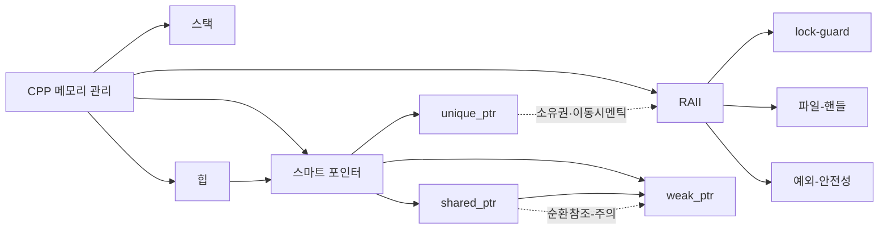

# C++ 메모리 관리 (스택 vs 힙, 스마트 포인터, RAII)

## 📌 학습 목표
- 스택과 힙의 차이를 명확히 이해  
- [스마트포인터]({{ site.baseurl }}/posts/whatis-smartpointer/) 사용법 학습  
- [RAII]({{ site.baseurl }}/posts/whatis-raii/) 개념과 활용  

---

## 📝 개념 정리

### 1. 스택 (Stack)
- 함수 호출 시 자동으로 할당/해제되는 메모리 영역  
- 지역 변수, 함수 인자 저장  
- LIFO 구조, 빠르지만 크기 제한이 있음  

```cpp
void Foo() {
    int x = 42;  // 스택에 저장, Foo() 종료 시 자동 해제
}
```

**주의점**  
- 지역 변수는 스택에 두는 것이 효율적  
- 너무 큰 배열/버퍼는 스택 오버플로우 위험 → 힙 사용 권장  

---

### 2. 힙 (Heap)
- `new` / `delete` 로 동적 할당되는 메모리  
- 크기가 유연하지만 관리 책임이 프로그래머에게 있음  
- 잘못 관리 시 메모리 누수 발생  

```cpp
void Foo() {
    int* p = new int(42); // 힙에 메모리 할당
    delete p;             // 반드시 해제 필요
}
```

**주의점**  
- `delete` 누락 → 메모리 누수  
- 중복 해제(double free) 위험  

---

### 3. [스마트포인터]({{ site.baseurl }}/posts/whatis-smartpointer/)
- C++11 이후 도입된 자동 자원 관리 도구  
- `unique_ptr`: 단일 소유권  
- `shared_ptr`: 참조 카운팅 기반 공유  
- `weak_ptr`: 순환 참조 방지  

```cpp
#include <memory>
void Foo() {
    std::unique_ptr<int> p1 = std::make_unique<int>(42);
    std::shared_ptr<int> p2 = std::make_shared<int>(100);
} // 범위 종료 시 자동 delete
```

**주의점**  
- `new/delete` 직접 사용보다 안전  
- `shared_ptr` 순환 참조 시 `weak_ptr`로 끊어야 함  

---

### 4. [RAII]({{ site.baseurl }}/posts/whatis-raii/) (Resource Acquisition Is Initialization)
- 객체 생성 시 자원 획득, 소멸 시 자원 해제  
- 예: 파일 핸들, 뮤텍스, 스마트 포인터  

```cpp
#include <iostream>
class FileHandler {
public:
    FileHandler() { std::cout << "Open file\n"; }
    ~FileHandler() { std::cout << "Close file\n"; }
};
void Foo() {
    FileHandler fh; // 함수 종료 시 자동으로 Close file 호출
}
```

**주의점**  
- 예외 안전성 보장  
- C++에서 가장 중요한 자원 관리 패턴  

### 5. 그 외의 다양한 포인터들

- `T*` : 내장 포인터 타입. 타입 T의 객체 혹은 인접해서 할당된 타입 T의 원소 시퀀스를 가리킨다.
- `T&` : 내장 참조 타입. 타입 T의 객체를 참조한다. 암묵적 역참조를 갖는 포인터.
- `span<T>` : 인접한 T 시퀀스로의 포인터
- `string_view<T>` : const 부분 문자열로의 포인터
- `X_iterator<C>` : C로부터의 원소 시퀀스. 이름에 들어있는 `X`는 반복자의 종류를 나타낸다.

---

## 🎯 연습 문제
1. `unique_ptr`와 `shared_ptr`의 차이를 설명하고, 순환 참조 문제를 `weak_ptr`로 해결하는 코드를 작성하세요.  
2. [RAII]({{ site.baseurl }}/posts/whatis-raii/) 패턴으로 `LockGuard` 클래스를 직접 구현해보세요.  
3. 스택에 할당된 변수와 힙에 할당된 변수를 디버거로 비교해보세요.  

---

## 🔎 심화 학습
- `malloc/free`와 `new/delete` 차이  
- `shared_ptr`의 내부 동작(제어 블록)  
- `std::scoped_lock`과 같은 [RAII]({{ site.baseurl }}/posts/whatis-raii/) 활용 사례  

---

## 🪞 회고
- 스택과 힙의 차이를 스스로 설명할 수 있는가?  
- 실무에서 [스마트포인터]({{ site.baseurl }}/posts/whatis-smartpointer/)를 언제 선택해야 하는가?  
- [RAII]({{ site.baseurl }}/posts/whatis-raii/) 개념이 없는 언어(C 언어)에서는 어떻게 자원 관리를 해야 할까?  

---

## 🔗 관련 페이지
- [객체지향]({{ site.baseurl }}/posts/whatis-oop/)  
- [클래스]({{ site.baseurl }}/posts/whatis-class/)  
- [스마트포인터]({{ site.baseurl }}/posts/whatis-smartpointer/)  
- [RAII]({{ site.baseurl }}/posts/whatis-raii/)  

---

## 쉽게 알아보자!


