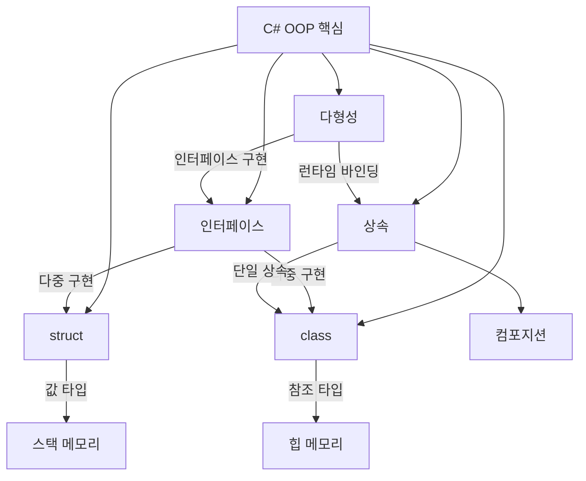

# C# 기본 문법과 OOP 핵심 정리

## 📌 학습 목표
- `class` vs `struct` 차이 완전 이해  
- [인터페이스]({{ site.baseurl }}/posts/whatis-interface/)와 [상속]({{ site.baseurl }}/posts/whatis-inheritance/)의 차이점과 활용법 학습  
- [객체지향]({{ site.baseurl }}/posts/whatis-oop/) 4대 특성 C# 관점에서 복습 진행  

---

## 📝 핵심 개념 정리

### 1. class vs struct

1. 클래스
- 참조 타입, 힙에 저장.  
- GC가 관리.  
- 상속 가능.  

2. struct
- 값 타입, 스택에 저장.  
- 할당/복사가 빠름.  
- 상속 불가.  

#### class - 참조 타입
```csharp
public class Person
{
    public string Name { get; set; }
    public int Age { get; set; }
    
    public Person(string name, int age)
    {
        Name = name;
        Age = age;
    }
}

// 사용 예제
Person person1 = new Person("김철수", 25);
Person person2 = person1;  // 참조 복사
person2.Age = 30;          // person1.Age도 30으로 변경됨
```

**특징:**
- **힙 메모리**에 저장
- **가비지 컬렉터**가 관리
- **상속 가능**
- **null 할당 가능**
- **참조 전달** (얕은 복사)

#### struct - 값 타입
```csharp
public struct Point
{
    public int X { get; set; }
    public int Y { get; set; }
    
    public Point(int x, int y)
    {
        X = x;
        Y = y;
    }
    
    public double Distance(Point other)
    {
        return Math.Sqrt(Math.Pow(X - other.X, 2) + Math.Pow(Y - other.Y, 2));
    }
}

// 사용 예제
Point point1 = new Point(1, 2);
Point point2 = point1;  // 값 복사
point2.X = 10;          // point1.X는 여전히 1
```

**특징:**
- **스택 메모리**에 저장
- **자동 관리** (스코프 벗어나면 해제)
- **상속 불가** (인터페이스 구현은 가능)
- **null 불가** (nullable struct 제외)
- **값 전달** (깊은 복사)

#### 언제 struct를 사용할까?
- **작은 데이터** (16바이트 이하 권장)
- **불변 객체**로 설계할 때
- **값 의미론**이 중요할 때
- **성능이 중요한 상황**

---

### 2. [인터페이스]({{ site.baseurl }}/posts/whatis-interface/)

- 다중 구현 가능.  
- 메서드 시그니처만 제공, 구현은 클래스에서.  

```csharp
// 인터페이스 정의
public interface IDrawable
{
    void Draw();
    void Resize(int width, int height);
    
    // C# 8.0부터 기본 구현 가능
    void Log() => Console.WriteLine("Drawing operation logged");
}

public interface IMovable
{
    void Move(int x, int y);
}

// 다중 인터페이스 구현
public class Circle : IDrawable, IMovable
{
    public int X { get; set; }
    public int Y { get; set; }
    public int Radius { get; set; }
    
    public void Draw()
    {
        Console.WriteLine($"원을 그립니다: 중심({X}, {Y}), 반지름{Radius}");
    }
    
    public void Resize(int width, int height)
    {
        Radius = Math.Min(width, height) / 2;
    }
    
    public void Move(int x, int y)
    {
        X = x;
        Y = y;
    }
}
```

**장점:**
- **다중 구현** 가능 (C#은 단일 상속만 지원)  
- **계약 정의** → 구현 클래스가 반드시 제공해야 할 기능  
- **느슨한 결합** → 인터페이스에 의존, 구체 클래스에 비의존  
- **테스트 용이성** → 모킹(Mock) 가능  

---

### 3. [상속]({{ site.baseurl }}/posts/whatis-inheritance/)

- 단일 상속만 허용.  
- 공통 동작을 재사용할 때 사용.  

```csharp
// 기본 클래스
public abstract class Animal
{
    public string Name { get; protected set; }
    
    protected Animal(string name)
    {
        Name = name;
    }
    
    // 가상 메서드 - 오버라이드 가능
    public virtual void MakeSound()
    {
        Console.WriteLine($"{Name}이(가) 소리를 냅니다.");
    }
    
    // 추상 메서드 - 반드시 구현해야 함
    public abstract void Eat();
}

// 파생 클래스
public class Dog : Animal
{
    public string Breed { get; set; }
    
    public Dog(string name, string breed) : base(name)
    {
        Breed = breed;
    }
    
    public override void MakeSound()
    {
        Console.WriteLine($"{Name}이(가) 멍멍 짖습니다.");
    }
    
    public override void Eat()
    {
        Console.WriteLine($"{Name}이(가) 사료를 먹습니다.");
    }
    
    // 새로운 메서드 추가
    public void Fetch()
    {
        Console.WriteLine($"{Name}이(가) 공을 가져옵니다.");
    }
}
```

---

### 4. 다형성 활용

- List<Animal>에 Dog, Cat 같은 파생 클래스를 담아도, Animal 타입으로 통일된 인터페이스를 통해 동작시킬 수 있음.
- 런타임에 **가상 메서드 테이블(vtable)**을 통해 실제 구현체의 메서드가 호출됨.
- 필요하다면 is 패턴 매칭으로 특정 파생 타입의 고유 기능 `Dog.Fetch()`도 안전하게 호출 가능.

```csharp
public class AnimalManager
{
    public void HandleAnimals(List<Animal> animals)
    {
        foreach (Animal animal in animals)
        {
            animal.MakeSound();  // 런타임에 적절한 메서드 호출
            animal.Eat();
            
            // 타입 확인 후 특별한 동작
            if (animal is Dog dog)
            {
                dog.Fetch();
            }
        }
    }
}

// 사용 예제
var animals = new List<Animal>
{
    new Dog("바둑이", "진돗개"),
    new Cat("나비", "페르시안")
};

var manager = new AnimalManager();
manager.HandleAnimals(animals);
```

---

## 💻 실전 예제

### 상속 vs 컴포지션 비교

- 상속(Inheritance): ElectricCar : Car 처럼 "is-a" 관계. 부모의 기능을 물려받음.
- 컴포지션(Composition): Car가 Engine과 FuelSystem을 포함("has-a"). 기능을 위임.
- 현대적인 설계에서는 상속보다 컴포지션을 선호. → 유연성 ↑, 결합도 ↓, 테스트 용이성 ↑

```csharp
// 상속 방식 (is-a 관계)
public class ElectricCar : Car
{
    public int BatteryLevel { get; set; }
    
    public void Charge()
    {
        BatteryLevel = 100;
        Console.WriteLine("전기차가 충전되었습니다.");
    }
}

// 컴포지션 방식 (has-a 관계) - 더 권장
public class Car
{
    private readonly Engine engine;
    private readonly FuelSystem fuelSystem;
    
    public Car(Engine engine, FuelSystem fuelSystem)
    {
        this.engine = engine;
        this.fuelSystem = fuelSystem;
    }
    
    public void Start()
    {
        if (fuelSystem.HasFuel())
        {
            engine.Start();
        }
    }
}

public class ElectricFuelSystem : FuelSystem
{
    public int BatteryLevel { get; set; }
    
    public override bool HasFuel() => BatteryLevel > 0;
    
    public void Charge() => BatteryLevel = 100;
}
```

---

### 인터페이스 분리 원칙 (ISP) 적용

- ISP (Interface Segregation Principle): "클라이언트는 자신이 사용하지 않는 메서드에 의존하지 않아야 한다."
- 나쁜 예: IBadMultiFunction → 프린터만 필요한 클래스도 Scan(), Fax()를 강제로 구현해야 함.
- 좋은 예: IPrinter, IScanner, IFaxMachine처럼 작은 단위로 분리 → 필요한 것만 선택 구현 가능.

```csharp
// 나쁜 예 - 하나의 큰 인터페이스
public interface IBadMultiFunction
{
    void Print();
    void Scan();
    void Fax();
    void Email();
}

// 좋은 예 - 기능별로 분리된 인터페이스
public interface IPrinter
{
    void Print();
}

public interface IScanner
{
    void Scan();
}

public interface IFaxMachine
{
    void Fax();
}

// 필요한 기능만 구현
public class SimplePrinter : IPrinter
{
    public void Print()
    {
        Console.WriteLine("문서를 인쇄합니다.");
    }
}

public class MultiFunctionDevice : IPrinter, IScanner, IFaxMachine
{
    public void Print() => Console.WriteLine("인쇄");
    public void Scan() => Console.WriteLine("스캔");
    public void Fax() => Console.WriteLine("팩스");
}
```

---

## 🎯 연습 문제
1. `IMovable` 인터페이스를 만들고 `Player`, `Enemy` 클래스에 구현하세요.  
2. `struct`와 `class`의 성능 및 메모리 차이를 실험하세요.  
3. [추상 클래스]({{ site.baseurl }}/posts/whatis-abstractclass/) vs [인터페이스]({{ site.baseurl }}/posts/whatis-interface/) 사용 시점을 예시로 설명하세요.  

---

## 🔎 심화 학습
- `struct`의 불변 패턴(Immutable Struct).  
- C# 8.0 이후 [인터페이스]({{ site.baseurl }}/posts/whatis-interface/)의 `default implementation`.  
- C++과 C#의 [상속]({{ site.baseurl }}/posts/whatis-inheritance/) 제약 비교.  
- [박싱과 언박싱]({{ site.baseurl }}/posts/whatis-boxingunboxing/) 문제와 성능 최적화.  

---

## 💡 실무 적용 팁
1. **적절한 타입 선택**  
   - 작고 불변인 데이터 → struct  
   - 복잡한 객체, 상속 필요 → class  

2. **인터페이스 설계 원칙**  
   - 단일 책임 원칙 적용  
   - 클라이언트가 사용하지 않는 기능에 의존하지 않게 설계  

3. **상속보다는 컴포지션**  
   - "is-a" 관계일 때만 상속 사용  
   - "has-a" 관계는 컴포지션 권장  

---

## 🪞 회고 질문
- 언제 **struct**를 사용하는 것이 더 적절할까?  
- [인터페이스]({{ site.baseurl }}/posts/whatis-interface/)와 [추상 클래스]({{ site.baseurl }}/posts/whatis-abstractclass/)의 차이를 실제 예시로 설명할 수 있는가?  
- [상속]({{ site.baseurl }}/posts/whatis-inheritance/)과 [컴포지션]({{ site.baseurl }}/posts/whatis-composition/) 중 어떤 것을 선택해야 하는지 판단 기준은 무엇인가?  
- 현재 프로젝트에서 [객체지향]({{ site.baseurl }}/posts/whatis-oop/) 원칙을 잘 적용하고 있는가?  

---

## 🚀 다음 학습 주제
다음으로는 **C# 메모리 관리**에서 [Garbage Collector]({{ site.baseurl }}/posts/whatis-gc/)의 동작 원리와 [IDisposable]({{ site.baseurl }}/posts/whatis-idisposable/) 패턴, [async-await]({{ site.baseurl }}/posts/whatis-asyncawait/) 내부 구조를 알아봅니다.  

---

## 🗺️ 개념 맵 (Mermaid 다이어그램)

