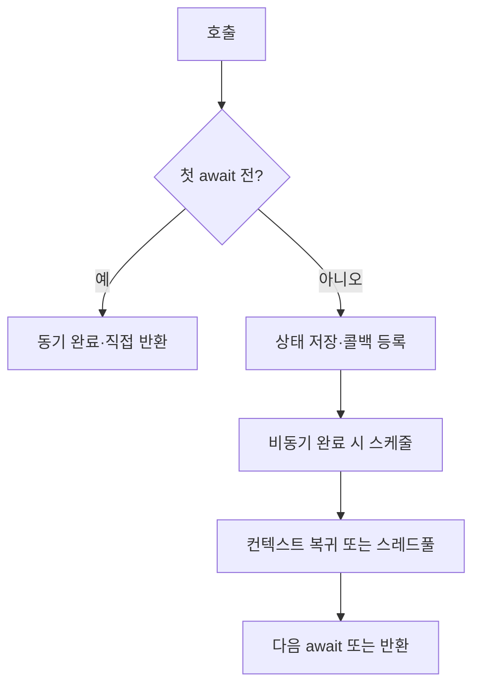

## 📌 학습 목표 (Learning Goals)
- 값/참조 형식과 스택/힙의 관계, [박싱/언박싱]({{ site.baseurl }}/posts/whatis-boxingunboxing/)의 비용을 명확히 설명한다.
- .NET [GC]({{ site.baseurl }}/posts/whatis-gc/)의 세대(Gen0/1/2), LOH/POH, Compact/Non-compacting, Server/Workstation 모드와 트리거를 설명한다.
- [IDisposable 패턴]({{ site.baseurl }}/posts/whatis-idisposable/) / [IAsyncDisposable]({{ site.baseurl }}/posts/whatis-idisposable/) 패턴과 [using 및 await using]({{ site.baseurl }}/posts/whatis-using/), 파이널라이저, `SafeHandle`, `GC.SuppressFinalize`의 역할과 모범 구현을 제시한다.
- [async/await]({{ site.baseurl }}/posts/whatis-asyncawait/)의 상태 머신, 컨텍스트 캡처, 할당/클로저 비용, `ValueTask`, `ConfigureAwait(false)`의 의미를 실전 예제로 설명한다.
- Unity/게임·서버 시나리오에서의 메모리/GC 튜닝 원칙을 제시한다. (참고: **준비 예정** → Unity 메모리 최적화 -> link 만들것)

---

## 🧠 C# 메모리 모델 한 장 요약

```text
[스택]           |  [힙]
-----------------|-------------------------------------------
메서드 프레임     | 참조형 인스턴스 (class, array, string 등)
값형 지역변수     | 박싱된 값형(필요 시)
리턴주소/레지스터 | LOH(>= ~85kB 배열 등), POH(핀 고정 목적)
                  | Gen0 -> Gen1 -> Gen2 (생존 시 승격)
```

- **값 형식(struct)**: 기본적으로 스택(또는 객체 내부/배열 내부)에 **값 자체** 저장. 인터페이스로 다루거나 `object`로 업캐스트하면 **박싱** 발생(힙에 새 객체 + 복사). → 자세히 보기: [박싱/언박싱]({{ site.baseurl }}/posts/whatis-boxingunboxing/)
- **참조 형식(class/배열/string)**: 힙에 할당, **참조(포인터)**가 스택/필드에 저장. → 개념 확장: [class]({{ site.baseurl }}/posts/whatis-class/), [OOP]({{ site.baseurl }}/posts/whatis-oop/)

> 면접 포인트: “`struct`는 항상 스택에?” ❌ **컨테이너 내부/필드에도 값으로 저장**될 수 있고, 대형 `struct`는 복사 비용이 큼. 불필요한 박싱을 피하려면 **제네릭 + 제약(where T : unmanaged/struct)** 또는 **인터페이스 대신 제네릭**을 검토. → 참고: [제네릭 인터페이스]({{ site.baseurl }}/posts/whatis-genericinterface/), [인터페이스]({{ site.baseurl }}/posts/whatis-interface/)

---

## ♻️ .NET GC 동작 원리 — 핵심만 빠르게
기초/심화 정리는 별도 글 참고: [GC란?]({{ site.baseurl }}/posts/whatis-gc/)

### 세대별 수집(Generational GC)
- **Gen0**: 단명 객체 대부분. 컬렉션이 가장 잦고 빠름.  
- **Gen1**: Gen0 생존 승격.  
- **Gen2**: 장수 객체(캐시/싱글톤 등). 수집 비용 큼.  
- **LOH (Large Object Heap)**: 일반적으로 **~85,000 바이트 이상** 배열 등의 대형 객체. 기본적으로 **비압축(non-compacting)** 수집 빈도 낮음.  
- **POH (Pinned Object Heap)**: 고정(pin)된 객체를 분리해 단편화 영향 최소화(.NET 5+).

### GC 트리거(언제 도는가?)
- 할당 실패/임계치 초과, `GC.Collect()` 호출(특별한 경우만), OS 메모리 압박, 백그라운드 GC 스케줄링 등.

### 모드/전략
- **Workstation vs Server GC**: 서버는 멀티코어 병렬 수집, 스루풋 우선. 데스크톱/Unity는 보통 Workstation.  
- **Background/Concurrent GC**: 대부분의 세대 수집을 애플리케이션과 병행.  
- **Compacting**: 단편화 방지를 위해 살아있는 객체를 압축 이동(LOH는 기본 비압축).

### 단편화 & Pinning
- 고정(pinning)은 **이동 불가** → 단편화 위험. P/Invoke, 고정 버퍼 등은 **고정 시간 최소화**.

> 면접 포인트: “왜 LOH가 문제?” → **수집 드뭄 + 비압축** 경향 → **메모리 급증/단편화** 위험. 대형 배열 재사용(pooling)로 완화.

---

## 🧯 IDisposable & using — 리소스 해제의 표준
기초/심화 정리는: [IDisposable]({{ site.baseurl }}/posts/whatis-idisposable/), [using/await using]({{ site.baseurl }}/posts/whatis-using/)

### 언제 필요한가?
- GC는 **메모리만** 회수. 파일 핸들, 소켓, DB 커넥션, GPU/OS 핸들 등 **관리되지 않는 자원**은 **명시적 해제** 필요 → `IDisposable.Dispose()` or `IAsyncDisposable.DisposeAsync()`.

### 정석 구현(권장: SafeHandle 사용)

```csharp
public sealed class NativeFile : IDisposable
{
    private SafeFileHandle _handle; // Microsoft.Win32.SafeHandles
    private bool _disposed;

    public NativeFile(string path)
    {
        _handle = CreateFileSafe(path); // P/Invoke로 핸들 취득
    }

    public void Write(ReadOnlySpan<byte> data) { /* ... */ }

    public void Dispose()
    {
        if (_disposed) return;
        _disposed = true;
        _handle?.Dispose(); // 핸들 안전 해제
        GC.SuppressFinalize(this);
    }

    ~NativeFile()
    {
        // 비상시 누수 방지. Dispose 미호출 케이스 처리
        _handle?.Dispose();
    }
}
```

- **핵심**: 리소스 소유권은 **한 방향(one owner)**. 파이널라이저는 **안전망**이지 정상 경로가 아님. 가능하면 `SafeHandle`로 래핑하여 파이널라이저 코드 최소화.  
- 자세한 패턴: [RAII(개념 연계)]({{ site.baseurl }}/posts/whatis-raii/) · [스마트 포인터(C++ 비교)]({{ site.baseurl }}/posts/whatis-smartpointer/)

### `using` / `await using`

```csharp
using (var s = new FileStream(path, FileMode.Open))
{
    // 범위를 벗어날 때 Dispose 자동 호출
}

await using (var conn = await OpenAsync())
{
    // 비동기 리소스 해제: await conn.DisposeAsync()
}
```

### 비동기 해제 패턴 (`IAsyncDisposable`)
```csharp
public sealed class AsyncSocket : IAsyncDisposable
{
    private readonly Socket _socket;
    public ValueTask DisposeAsync()
    {
        // 네트워크 종료 핸드셰이크 등 비동기 해제가 필요한 경우
        return new ValueTask(CloseAsync(_socket));
    }
}
```

> 면접 포인트: 파이널라이저 + `GC.SuppressFinalize` 조합 이유? → **중복 해제 방지**와 **GC 비용 절감**. 파이널라이저 큐 등록 자체가 비용.  
> 더 읽기: [IDisposable]({{ site.baseurl }}/posts/whatis-idisposable/), [using/await using]({{ site.baseurl }}/posts/whatis-using/)

---

## 🧵 async/await — 상태 머신과 메모리
개요/심화: [async/await 가이드]({{ site.baseurl }}/posts/whatis-asyncawait/)

### 어떤 일이 벌어지나?
- `async` 메서드는 **상태 머신 클래스로 변환**. 지역 변수/캡처 변수가 **필드로 승격**되어 힙 할당이 발생할 수 있음.
- `await`는 비동기 작업이 **완료 시점에 이어서 실행**하도록 콜백을 등록. 기본적으로 **현재 컨텍스트(SynchronizationContext/TaskScheduler)**를 캡처.

```csharp
public async Task<int> FetchAsync()
{
    var client = new HttpClient(); // 할당
    var json = await client.GetStringAsync(url); // await 지점에서 상태 머신 유지
    return json.Length;
}
```

### 성능/메모리 팁
- **컨텍스트 캡처 방지**: 라이브러리/서버 코드에서 `ConfigureAwait(false)`
```csharp
await task.ConfigureAwait(false);
```
- **할당 줄이기**: 자주 호출되는 hot path는 `ValueTask` 고려(단, 오용 시 복잡성↑)  
- **클로저 주의**: 람다/로컬 함수가 외부 변수를 캡처하면 힙 할당 발생.  
- **`async void` 금지**: 이벤트 핸들러 외에는 사용 금지(예외 전파 불가, 추적 어려움).  
- **`Task.Run` 남용 금지**: I/O 바운드에 CPU 스레드 할당 불필요.  
- **타임아웃/취소 토큰** 필수: 누수/좀비 작업 방지.

### 상태 머신 도식


---

## 🧪 박싱/언박싱 & 제네릭 최적화
기본 개념: [박싱/언박싱]({{ site.baseurl }}/posts/whatis-boxingunboxing/) · 제너릭 심화: [제네릭 인터페이스]({{ site.baseurl }}/posts/whatis-genericinterface/)

```csharp
// 나쁨: 인터페이스가 값형을 참조하면 박싱 발생
void SumBad(IEnumerable<int> xs)
{
    IComparable c = 42; // 박싱
}

// 좋음: 제네릭으로 값형을 직접 다루면 박싱 없음
int SumGood<T>(ReadOnlySpan<T> xs) where T : unmanaged
{
    // 값형 T를 그대로 연산
    return xs.Length;
}
```

- **컬렉션**: `List<int>`는 **무박싱**. 반면 `ArrayList`/`IList`(비제네릭) 사용 시 박싱 발생.  
- **딕셔너리 키**로 박싱 유발 타입 사용에 주의(예: `struct`를 인터페이스로 보관).

---

## 🎮 Unity/게임 개발 관점 메모리 팁
- **GC 스파이크 최소화**: 프레임 중 대량 할당/해제를 피하고, **오브젝트 풀링** 적극 사용.  
- **문자열/boxing 주의**: `string.Format`, `ToString()`(특히 `Update()`에서) 남발 금지.  
- **LINQ 임시 할당**: GC 부담 → 핫패스에서는 for 루프/Span/NativeArray 고려.  
- **대형 배열/버퍼 재사용**: LOH 단편화 완화.  
- **Pinned/Native 메모리**: 고정 시간 최소화, 네이티브 리소스는 `IDisposable` 철저.  

---

## 🔐 안전한 리소스 해제 — 패턴 모음

### Dispose 패턴(관리/비관리 혼합)
```csharp
public class ResourceHolder : IDisposable
{
    private SafeHandle _handle = /* ... */;
    private ManagedThing _managed = new();
    private bool _disposed;

    public void Dispose()
    {
        Dispose(true);
        GC.SuppressFinalize(this);
    }

    protected virtual void Dispose(bool disposing)
    {
        if (_disposed) return;
        if (disposing)
        {
            _managed?.Dispose();
            _handle?.Dispose();
        }
        // 비관리 리소스 해제 필요 시 여기서
        _disposed = true;
    }

    ~ResourceHolder() => Dispose(false);
}
```

### Async Dispose 패턴
```csharp
public class AsyncResource : IAsyncDisposable
{
    private IAsyncDisposable _async; // 예: Stream, DbConnection 등
    public async ValueTask DisposeAsync()
    {
        if (_async != null)
        {
            await _async.DisposeAsync();
        }
    }
}
```

---

## 🧰 실전 체크리스트
- [ ] 파일/소켓/DB/GPU 핸들은 `using` 혹은 명시적 `Dispose()`로 닫았다. → [IDisposable]({{ site.baseurl }}/posts/whatis-idisposable/)  
- [ ] `async void`는 이벤트 핸들러에서만 사용했다. → [async/await]({{ site.baseurl }}/posts/whatis-asyncawait/)  
- [ ] 라이브러리/서버 코드에서 `ConfigureAwait(false)`를 사용했다.  
- [ ] 큰 버퍼는 풀링(ArrayPool, MemoryPool)으로 재사용한다.  
- [ ] 핫패스에서 LINQ/박싱/클로저/예외 사용을 줄였다. → [클린 코드]({{ site.baseurl }}/posts/whatis-clean-code/)  
- [ ] 파이널라이저는 **최소화**하고, `GC.SuppressFinalize`를 호출했다. → [GC]({{ site.baseurl }}/posts/whatis-gc/)  
- [ ] 핀 고정은 꼭 필요한 최소 시간만 사용했다.

---

## ❓자주 묻는 면접 질문(모범 답안 키워드)
1) **GC는 언제 동작하나요?** — 세대별 임계치/할당 실패/백그라운드 스케줄/OS 메모리 압박. Gen0→1→2, LOH 별도. → [GC]({{ site.baseurl }}/posts/whatis-gc/)  
2) **LOH 문제와 대처?** — 드문 수집·비압축 → 단편화 위험. 큰 배열 풀링/재사용.  
3) **IDisposable이 필요한 이유?** — GC는 메모리만, OS/네이티브 리소스는 명시 해제 필요. → [IDisposable]({{ site.baseurl }}/posts/whatis-idisposable/)  
4) **파이널라이저와 Dispose 차이?** — 파이널라이저는 비결정/비용↑, 안전망. Dispose는 결정적 해제.  
5) **`async/await`의 컨텍스트 캡처?** — 기본 현재 컨텍스트 복귀. 서버/라이브러리에서 `ConfigureAwait(false)`. → [async/await]({{ site.baseurl }}/posts/whatis-asyncawait/)  
6) **`ValueTask` 언제?** — 자주 동기 완료되는 경로에서 할당 줄일 때. 남용 주의.  
7) **박싱이 뭐고 어떻게 줄이나요?** — 값형→참조형 변환 시 힙 할당. 제네릭/Span 활용. → [박싱/언박싱]({{ site.baseurl }}/posts/whatis-boxingunboxing/), [제네릭 인터페이스]({{ site.baseurl }}/posts/whatis-genericinterface/)

---

## 🧪 연습 문제(코딩 포함)
1) `IDisposable` 패턴을 갖는 `TempFile` 클래스를 만들고 파일 생성→쓰기→삭제를 `using`으로 보장하라. → [IDisposable]({{ site.baseurl }}/posts/whatis-idisposable/)  
2) `async` 핫패스에서 `ValueTask`로 전환하여 할당을 줄이고 벤치마크를 비교하라. → [async/await]({{ site.baseurl }}/posts/whatis-asyncawait/)  
3) LOH에 올라가는 버퍼를 `ArrayPool<byte>`로 재사용하는 코드 작성.  
4) Unity `Update()`에서 발생하는 GC 알로케이션을 프로파일러로 찾아 제거하라.

---

## 💡 실무 적용 팁
1. **GC 모니터링**: `GC.GetTotalMemory()`와 성능 카운터로 메모리 사용량 추적 → [GC]({{ site.baseurl }}/posts/whatis-gc/)  
2. **IDisposable 일관성**: 팀 내에서 using 문 사용 가이드라인 수립 → [using]({{ site.baseurl }}/posts/whatis-using/)  
3. **async/await 데드락 방지**: UI 애플리케이션에서 `ConfigureAwait(false)` 활용 → [async/await]({{ site.baseurl }}/posts/whatis-asyncawait/)  
4. **박싱 방지**: 컬렉션 사용 시 제네릭 타입 우선 선택 → [박싱/언박싱]({{ site.baseurl }}/posts/whatis-boxingunboxing/)

---

## 다음 학습 주제
- **C# 고급 메모리 관리**: `Span<T>`, `Memory<T>`, 스택 할당 최적화  
- **Task 병렬 라이브러리**: `Parallel.ForEach`, PLINQ 활용  
- **메모리 프로파일링**: dotMemory, PerfView를 통한 성능 분석

---

## 📎 치트시트(요약)
- **세대 GC**: Gen0 빠름, Gen2 비쌈. 생존 객체 승격. → [GC]({{ site.baseurl }}/posts/whatis-gc/)  
- **LOH/POH**: 큰 배열은 LOH, 핀은 POH. 풀링/재사용.  
- **Dispose 규칙**: using/await using, SafeHandle, SuppressFinalize. → [IDisposable]({{ site.baseurl }}/posts/whatis-idisposable/) · [using]({{ site.baseurl }}/posts/whatis-using/)  
- **async/await**: 상태 머신→힙 할당 가능. `ConfigureAwait(false)`, `async void` 금지. → [async/await]({{ site.baseurl }}/posts/whatis-asyncawait/)  
- **박싱 회피**: 제네릭/Span/ValueTask. 비제네릭 컬렉션 지양. → [박싱/언박싱]({{ site.baseurl }}/posts/whatis-boxingunboxing/)

---

## 🪞 회고 질문
- GC의 세대별 수집 방식이 성능에 미치는 영향을 설명할 수 있는가? → [GC]({{ site.baseurl }}/posts/whatis-gc/)  
- IDisposable 패턴을 실무 프로젝트에서 어떤 상황에 적용할 수 있을까? → [IDisposable]({{ site.baseurl }}/posts/whatis-idisposable/)  
- async/await 사용 시 주의해야 할 데드락 상황은 무엇인가? → [async/await]({{ site.baseurl }}/posts/whatis-asyncawait/)  
- 박싱/언박싱으로 인한 성능 저하를 어떻게 측정하고 개선할 수 있을까? → [박싱/언박싱]({{ site.baseurl }}/posts/whatis-boxingunboxing/)

---

## 📚 참고 키워드
`Server GC`, `Workstation GC`, `Background GC`, `SafeHandle`, `ArrayPool<T>`, `MemoryPool<T>`, `Span<T>/Memory<T>`, `ValueTask`, `IAsyncDisposable`, `SynchronizationContext`, `TaskScheduler`, `ConfigureAwait(false)`, `stackalloc`.

---
