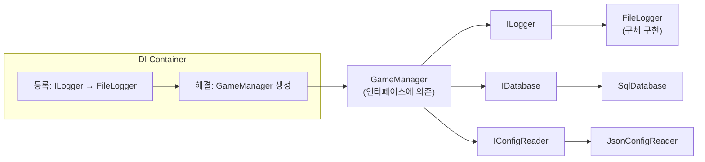
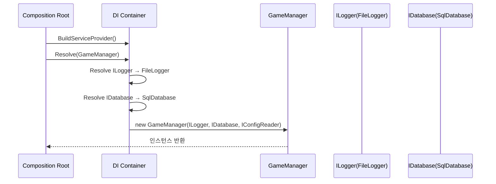

# 의존성 주입(Dependency Injection)이란?

## 📌 학습 목표
- 의존성 주입의 개념과 필요성 이해
- DI Container와 IoC 컨테이너 활용법 학습
- 게임 개발에서의 실제 적용 사례 파악
- 테스트 용이성과 유지보수성 향상 방법 습득

## 📌 정의
**의존성 주입(Dependency Injection, DI)**은 객체가 필요로 하는 의존성을 **외부에서 주입받는** 디자인 패턴입니다.  
객체가 **스스로 new로 만들지 않고**, 생성자/프로퍼티/메서드를 통해 외부에서 전달받아 **결합도를 낮추고 유연성을 높입니다**.  

- **IoC (Inversion of Control)**: “누가 무엇을 제어하는가?”를 뒤집음. 객체 생성·조립을 프레임워크/컨테이너가 맡음  
- **DI Container**: 의존성의 **등록(Configure)**, **해결(Resolve)**, **생명주기(Lifetime)** 를 관리하는 도구  
- **Service Locator와의 차이**: DI는 **밖에서 넣어줌(명시적)**, Service Locator는 **안에서 찾아옴(암시적)** → 숨은 의존성 증가

---

## 🤔 왜 DI가 필요한가? (문제 인식)
- **강한 결합**: 클래스 내부에서 구체 클래스를 직접 생성하면 교체·확장이 어렵다  
- **테스트 어려움**: 파일/DB/네트워크 등 외부 자원에 강결합 → **단위 테스트 불가/느림**  
- **변경 비용 증가**: 로깅 방식, DB, 플랫폼별 구현을 바꿀 때 **소스 수정**이 연쇄적으로 발생  
- **의존성 그래프 복잡화**: “의존성의 의존성”까지 직접 관리해야 해 **초기화 순서/생명주기** 문제가 생김

---

## 🔑 DI가 해결하는 문제

### 1. 강한 결합도 문제 (Before DI)

구체 클래스(FileLogger/SqlDatabase/JsonConfigReader)를 **직접 new** 하면, 교체·테스트가 힘들고 설정 변경도 코드 재컴파일이 필요합니다.


```csharp
// 나쁜 예 - 강한 결합
public class GameManager
{
    private FileLogger logger;           // 구체 클래스에 의존
    private SqlDatabase database;        // 구체 클래스에 의존
    private JsonConfigReader config;     // 구체 클래스에 의존

    public GameManager()
    {
        // 직접 생성 - 테스트 어려움, 변경 어려움
        logger = new FileLogger("game.log");
        database = new SqlDatabase("connection_string");
        config = new JsonConfigReader("config.json");
    }

    public void StartGame()
    {
        logger.Log("게임 시작");
        var settings = config.ReadSettings();
        database.SaveGameSession(new GameSession());
    }
}

// 문제점:
// 1. FileLogger가 변경되면 GameManager도 수정 필요
// 2. 단위 테스트 시 실제 파일/DB가 필요
// 3. 설정 변경을 위해 코드 수정 필요
// 4. 의존성의 의존성까지 모두 알아야 함
```

**문제점 요약**  
1) 구현 변경 시 호출부 수정 필요, 2) 테스트에서 실제 파일/DB 필요, 3) 설정 변경이 코드 변경과 결합, 4) 의존성 그래프를 직접 다 알아야 함


### 2. 의존성 주입으로 해결 (After DI)

클래스는 **인터페이스**에만 의존하고, 구현체는 **외부(컨테이너/조립 루트)** 에서 주입합니다. 테스트에선 목(Mock) 구현을 넣기 쉬워지고, 런타임 교체도 간단해집니다.

```csharp
// 좋은 예 - 느슨한 결합
public interface ILogger
{
    void Log(string message);
}

public interface IDatabase
{
    void SaveGameSession(GameSession session);
}

public interface IConfigReader
{
    GameSettings ReadSettings();
}

public class GameManager
{
    private readonly ILogger logger;
    private readonly IDatabase database;
    private readonly IConfigReader config;

    // 생성자 주입 - 필요한 의존성을 외부에서 받음
    public GameManager(ILogger logger, IDatabase database, IConfigReader config)
    {
        this.logger = logger ?? throw new ArgumentNullException(nameof(logger));
        this.database = database ?? throw new ArgumentNullException(nameof(database));
        this.config = config ?? throw new ArgumentNullException(nameof(config));
    }

    public void StartGame()
    {
        logger.Log("게임 시작");
        var settings = config.ReadSettings();
        database.SaveGameSession(new GameSession());
    }
}

// 장점:
// 1. 인터페이스에만 의존 - 구현체 변경 자유
// 2. Mock 객체로 쉬운 단위 테스트
// 3. 런타임에 다른 구현체 주입 가능
// 4. 단일 책임 원칙 준수
```


**장점 요약**  
1) 인터페이스 기반 → 구현 교체 자유, 2) Mock 주입으로 **단위 테스트 용이**, 3) 런타임 전략 교체, 4) 단일 책임·개방폐쇄 원칙 준수


---

## 🎯 DI 주입 방법

### 1. 생성자 주입 (Constructor Injection) - 권장

필수 의존성을 **불변(읽기전용)** 으로 보장. 객체가 **유효한 상태**로만 생성되며, 순환 의존도 조기에 드러남.


```csharp
public class PlayerController
{
    private readonly IInputManager inputManager;
    private readonly IAnimationController animationController;
    private readonly IAudioManager audioManager;

    // 필수 의존성을 생성자에서 받음
    public PlayerController(
        IInputManager inputManager,
        IAnimationController animationController,
        IAudioManager audioManager)
    {
        this.inputManager = inputManager;
        this.animationController = animationController;
        this.audioManager = audioManager;
    }

    public void Update()
    {
        var input = inputManager.GetInput();
        if (input.IsJumping)
        {
            animationController.PlayJumpAnimation();
            audioManager.PlayJumpSound();
        }
    }
}

// 장점: 불변성 보장, 필수 의존성 명확, 순환 의존성 방지
```

### 2. 프로퍼티 주입 (Property Injection)

**선택적** 의존성에 적합. 단, **null 체크** 필요하고 런타임 미설정 리스크 존재.

```csharp
public class WeaponSystem
{
    // 선택적 의존성에 사용
    public IEffectManager EffectManager { get; set; }
    public ISoundManager SoundManager { get; set; }

    public void FireWeapon()
    {
        // null 체크 후 사용
        EffectManager?.ShowMuzzleFlash();
        SoundManager?.PlayGunfire();
    }
}

// 사용처에서 설정
var weaponSystem = new WeaponSystem();
weaponSystem.EffectManager = effectManager;
weaponSystem.SoundManager = soundManager;
```

### 3. 메서드 주입 (Method Injection)

특정 호출에서만 필요한 의존성을 **매개변수**로 전달. 전략을 **런타임 선택**할 때 유용.


```csharp
public class GameRenderer
{
    public void RenderFrame(ICamera camera, ILightingManager lighting)
    {
        // 매번 다른 카메라나 라이팅으로 렌더링 가능
        var viewMatrix = camera.GetViewMatrix();
        var lightData = lighting.GetLightData();

        // 렌더링 로직...
    }
}
```

---

## 🛠️ DI Container 활용

### 1. .NET의 내장 DI Container

DI 컨테이너는 인터페이스와 구현체를 **등록**하고, 요청 시 **해결(Resolve)** 하며, **생명주기(Lifetime)** 를 관리합니다. .NET 기본 컨테이너 예시는 다음과 같습니다.

```csharp
using Microsoft.Extensions.DependencyInjection;
using Microsoft.Extensions.Hosting;

public class GameApplication
{
    public static void Main(string[] args)
    {
        // DI Container 설정
        var services = new ServiceCollection();
        ConfigureServices(services);

        var serviceProvider = services.BuildServiceProvider();

        // 게임 매니저 실행
        var gameManager = serviceProvider.GetRequiredService<IGameManager>();
        gameManager.StartGame();
    }

    private static void ConfigureServices(IServiceCollection services)
    {
        // 인터페이스와 구현체 등록
        services.AddSingleton<ILogger, FileLogger>();
        services.AddSingleton<IDatabase, SqlDatabase>();
        services.AddScoped<IConfigReader, JsonConfigReader>();

        // 게임 관련 서비스들
        services.AddSingleton<IInputManager, InputManager>();
        services.AddSingleton<IAudioManager, AudioManager>();
        services.AddTransient<IPlayerController, PlayerController>();
        services.AddScoped<IGameManager, GameManager>();

        // 설정값 주입
        services.Configure<GameSettings>(config =>
        {
            config.ScreenWidth = 1920;
            config.ScreenHeight = 1080;
            config.Fullscreen = true;
        });
    }
}
```

### 2. 생명주기 관리

**생명주기 요약**
- **Singleton**: 앱 전역 1개 (예: 설정, 캐시, 오디오 매니저)  
- **Scoped**: 요청/세션 범위 1개 (예: 게임 세션, 플레이어 컨텍스트)  
- **Transient**: 매번 새 인스턴스 (예: 총알, 이펙트, 커맨드 객체)

**주의:** Critical Path에서는 매 프레임 `GetService()` 호출보다 **생성자 주입 + 캐싱**이 유리합니다.


```csharp
// Singleton - 앱 전체에서 하나의 인스턴스
services.AddSingleton<IAudioManager, AudioManager>();

// Scoped - 요청/게임 세션당 하나의 인스턴스
services.AddScoped<IGameSession, GameSession>();

// Transient - 매번 새로운 인스턴스
services.AddTransient<IProjectile, Bullet>();

// 팩토리 패턴과 결합
services.AddTransient<Func<string, IWeapon>>(provider => weaponType =>
{
    return weaponType switch
    {
        "rifle" => provider.GetService<Rifle>(),
        "pistol" => provider.GetService<Pistol>(),
        "shotgun" => provider.GetService<Shotgun>(),
        _ => throw new ArgumentException($"Unknown weapon type: {weaponType}")
    };
});
```

---

## 🎮 게임 개발 실제 사례

### 1. 게임 시스템 간 결합도 해결

전투 처리(Combat)가 체력/인벤토리/퀘스트/오디오 등 여러 시스템에 걸쳐 있을 때, 인터페이스 주입으로 **모듈 간 결합을 낮추고 테스트 가능성**을 확보합니다.


```csharp
// 게임의 핵심 시스템들
public interface IHealthSystem
{
    void TakeDamage(int entityId, int damage);
    void Heal(int entityId, int amount);
    int GetHealth(int entityId);
}

public interface IInventorySystem
{
    void AddItem(int playerId, Item item);
    bool UseItem(int playerId, int itemId);
    List<Item> GetInventory(int playerId);
}

public interface IQuestSystem
{
    void StartQuest(int playerId, Quest quest);
    void CompleteQuest(int playerId, int questId);
    void UpdateQuestProgress(int playerId, string objective);
}

// 플레이어 액션이 여러 시스템에 영향
public class CombatManager
{
    private readonly IHealthSystem healthSystem;
    private readonly IInventorySystem inventorySystem;
    private readonly IQuestSystem questSystem;
    private readonly IAudioManager audioManager;

    public CombatManager(
        IHealthSystem healthSystem,
        IInventorySystem inventorySystem,
        IQuestSystem questSystem,
        IAudioManager audioManager)
    {
        this.healthSystem = healthSystem;
        this.inventorySystem = inventorySystem;
        this.questSystem = questSystem;
        this.audioManager = audioManager;
    }

    public void ProcessAttack(int attackerId, int targetId, int damage)
    {
        // 데미지 적용
        healthSystem.TakeDamage(targetId, damage);

        // 사운드 재생
        audioManager.PlayHitSound();

        // 무기 내구도 감소 (인벤토리 시스템)
        var weapon = inventorySystem.GetEquippedWeapon(attackerId);
        weapon?.DecreaseDurability();

        // 퀘스트 진행도 업데이트
        questSystem.UpdateQuestProgress(attackerId, "enemy_killed");

        // 체력이 0이 되면 추가 처리
        if (healthSystem.GetHealth(targetId) <= 0)
        {
            HandleDeath(targetId);
        }
    }

    private void HandleDeath(int entityId)
    {
        // 사망 처리 로직
        audioManager.PlayDeathSound();
        questSystem.UpdateQuestProgress(entityId, "player_death");
    }
}
```

### 2. 플랫폼별 구현체 교체

PC/콘솔/모바일별 저장·업적·네트워크 API가 다른 경우, **플랫폼 서비스 인터페이스**로 추상화하고 **DI로 구현을 교체**합니다.

```csharp
// 플랫폼 추상화
public interface IPlatformService
{
    void SaveGame(GameSaveData data);
    GameSaveData LoadGame();
    void ShowAchievement(string achievementId);
    bool IsOnline();
}

// PC 구현
public class PCPlatformService : IPlatformService
{
    public void SaveGame(GameSaveData data)
    {
        File.WriteAllText("savegame.json", JsonSerializer.Serialize(data));
    }

    public GameSaveData LoadGame()
    {
        if (File.Exists("savegame.json"))
        {
            var json = File.ReadAllText("savegame.json");
            return JsonSerializer.Deserialize<GameSaveData>(json);
        }
        return new GameSaveData();
    }

    public void ShowAchievement(string achievementId)
    {
        // Steam API 호출
        SteamAPI.ShowAchievement(achievementId);
    }

    public bool IsOnline() => NetworkInterface.GetIsNetworkAvailable();
}

// 콘솔 구현
public class ConsolePlatformService : IPlatformService
{
    public void SaveGame(GameSaveData data)
    {
        // 콘솔 전용 세이브 시스템
        ConsoleAPI.SaveToCloud(data);
    }

    public GameSaveData LoadGame()
    {
        return ConsoleAPI.LoadFromCloud();
    }

    public void ShowAchievement(string achievementId)
    {
        // 콘솔 업적 시스템
        ConsoleAPI.UnlockAchievement(achievementId);
    }

    public bool IsOnline() => ConsoleAPI.IsConnectedToService();
}

// 게임에서 사용 - 플랫폼에 관계없이 동일한 코드
public class GameSaveManager
{
    private readonly IPlatformService platformService;

    public GameSaveManager(IPlatformService platformService)
    {
        this.platformService = platformService;
    }

    public void SaveProgress(Player player)
    {
        var saveData = new GameSaveData
        {
            Level = player.Level,
            Experience = player.Experience,
            Inventory = player.Inventory.Items
        };

        platformService.SaveGame(saveData);

        if (player.Level >= 10)
        {
            platformService.ShowAchievement("REACH_LEVEL_10");
        }
    }
}
```

### 3. A/B 테스트와 피처 플래그

새로운 밸런스/공식 실험 시, 고정 코드 대신 **Feature Toggle 인터페이스**를 주입해 런타임 변경성을 확보합니다.

```csharp
public interface IFeatureToggle
{
    bool IsEnabled(string featureName);
    T GetConfiguration<T>(string configKey);
}

public class GameplayManager
{
    private readonly IFeatureToggle featureToggle;
    private readonly IBalanceManager balanceManager;

    public GameplayManager(IFeatureToggle featureToggle, IBalanceManager balanceManager)
    {
        this.featureToggle = featureToggle;
        this.balanceManager = balanceManager;
    }

    public void CalculateDamage(AttackData attack)
    {
        int damage = attack.BaseDamage;

        // A/B 테스트: 새로운 데미지 공식 테스트
        if (featureToggle.IsEnabled("NEW_DAMAGE_FORMULA"))
        {
            var multiplier = featureToggle.GetConfiguration<float>("DAMAGE_MULTIPLIER");
            damage = (int)(damage * multiplier);
        }

        // 밸런스 패치 적용
        damage = balanceManager.ApplyDamageModifiers(damage, attack.WeaponType);

        // 최종 데미지 적용
        ApplyDamage(attack.TargetId, damage);
    }
}
```

---

## 🧪 테스트 용이성

### 1. 단위 테스트에서 Mock 활용

DI는 테스트에서 **진짜 외부 자원 대신 Mock**을 끼워 넣을 수 있게 해줍니다.  
Moq/NSubstitute 같은 프레임워크로 **호출·인자 검증**이 쉬워집니다.

```csharp
[Test]
public void PlayerController_Jump_ShouldPlayAnimation()
{
    // Arrange - Mock 객체 생성
    var mockInputManager = new Mock<IInputManager>();
    var mockAnimationController = new Mock<IAnimationController>();
    var mockAudioManager = new Mock<IAudioManager>();

    // 입력 시뮬레이션
    mockInputManager.Setup(x => x.GetInput())
               .Returns(new InputData { IsJumping = true });

    var controller = new PlayerController(
        mockInputManager.Object,
        mockAnimationController.Object,
        mockAudioManager.Object);

    // Act
    controller.Update();

    // Assert
    mockAnimationController.Verify(x => x.PlayJumpAnimation(), Times.Once);
    mockAudioManager.Verify(x => x.PlayJumpSound(), Times.Once);
}

[Test]
public void CombatManager_ProcessAttack_ShouldReduceHealth()
{
    // Arrange
    var mockHealthSystem = new Mock<IHealthSystem>();
    var mockInventorySystem = new Mock<IInventorySystem>();
    var mockQuestSystem = new Mock<IQuestSystem>();
    var mockAudioManager = new Mock<IAudioManager>();

    mockHealthSystem.Setup(x => x.GetHealth(It.IsAny<int>())).Returns(50);

    var combatManager = new CombatManager(
        mockHealthSystem.Object,
        mockInventorySystem.Object,
        mockQuestSystem.Object,
        mockAudioManager.Object);

    // Act
    combatManager.ProcessAttack(playerId: 1, targetId: 2, damage: 20);

    // Assert
    mockHealthSystem.Verify(x => x.TakeDamage(2, 20), Times.Once);
    mockAudioManager.Verify(x => x.PlayHitSound(), Times.Once);
}
```

### 2. 통합 테스트 설정
```csharp
public class GameIntegrationTest
{
    private IServiceProvider serviceProvider;

    [SetUp]
    public void Setup()
    {
        var services = new ServiceCollection();

        // 실제 서비스 대신 테스트용 구현체 등록
        services.AddSingleton<ILogger, TestLogger>();
        services.AddSingleton<IDatabase, InMemoryDatabase>();
        services.AddSingleton<IFileSystem, MockFileSystem>();

        // 실제 게임 로직은 그대로
        services.AddScoped<IGameManager, GameManager>();
        services.AddScoped<IPlayerController, PlayerController>();

        serviceProvider = services.BuildServiceProvider();
    }

    [Test]
    public void GameFlow_StartToComplete_ShouldWork()
    {
        // 전체 게임 플로우 테스트
        var gameManager = serviceProvider.GetRequiredService<IGameManager>();

        gameManager.StartGame();
        gameManager.LoadLevel("level1");
        gameManager.ProcessPlayerAction("move_forward");

        Assert.That(gameManager.CurrentState, Is.EqualTo(GameState.Playing));
    }
}
```

---

## ⚡ 성능 고려사항

- **Service Locator 남용 금지**: 숨은 의존성으로 설계가 불투명해짐  
- **순환 의존성 방지**: 이벤트 버스/중재자 패턴/인터페이스 분리로 해소  
- **과도한 인터페이스화**: 단순 타입까지 추상화하면 복잡도만 증가  
- **Critical Path 최적화**: 프레임마다 Resolve 호출 지양, **생성자 주입 + 캐싱**  
- **라이프사이클 혼동 금지**: Singleton에 상태를 쌓아 다중 세션 간 오염 주의

### 1. DI Container 오버헤드
```csharp
// 성능 Critical한 곳에서는 직접 캐싱
public class PerformanceCriticalSystem
{
    private readonly ILogger logger;
    private readonly IServiceProvider serviceProvider;

    // 자주 사용하는 서비스는 생성자에서 받기
    public PerformanceCriticalSystem(ILogger logger, IServiceProvider serviceProvider)
    {
        this.logger = logger;
        this.serviceProvider = serviceProvider;
    }

    public void EveryFrameUpdate()
    {
        // 매 프레임마다 GetService 호출하지 말 것!
        // var heavyService = serviceProvider.GetService<IHeavyService>(); // 나쁨

        // 대신 필요할 때만 캐싱
        heavyService ??= serviceProvider.GetService<IHeavyService>();
    }

    private IHeavyService heavyService;
}
```

### 2. 순환 의존성 방지
```csharp
// 잘못된 설계 - 순환 의존성
public class PlayerManager
{
    private readonly IGameManager gameManager; // GameManager에 의존

    public PlayerManager(IGameManager gameManager)
    {
        this.gameManager = gameManager;
    }
}

public class GameManager
{
    private readonly IPlayerManager playerManager; // PlayerManager에 의존

    public GameManager(IPlayerManager playerManager)
    {
        this.playerManager = playerManager; // 순환 의존성!
    }
}

// 해결 방법 1: 중재자 패턴
public interface IEventBus
{
    void Publish<T>(T eventData);
    void Subscribe<T>(Action<T> handler);
}

public class PlayerManager
{
    private readonly IEventBus eventBus;

    public PlayerManager(IEventBus eventBus)
    {
        this.eventBus = eventBus;
        eventBus.Subscribe<PlayerLevelUpEvent>(OnPlayerLevelUp);
    }

    private void OnPlayerLevelUp(PlayerLevelUpEvent eventData)
    {
        // 이벤트 처리
    }
}

// 해결 방법 2: 인터페이스 분리
public interface IPlayerEvents
{
    event Action<Player> PlayerLevelUp;
    event Action<Player> PlayerDied;
}

public class GameManager
{
    private readonly IPlayerEvents playerEvents; // 전체가 아닌 이벤트만

    public GameManager(IPlayerEvents playerEvents)
    {
        this.playerEvents = playerEvents;
        playerEvents.PlayerLevelUp += OnPlayerLevelUp;
    }
}
```

---

## 💡 실무 적용 팁

### 1. 게임 개발에서의 베스트 프랙티스
```csharp
// 1. 게임 시스템은 인터페이스로 추상화
public interface IGameSystem
{
    void Initialize();
    void Update(float deltaTime);
    void Cleanup();
    int Priority { get; }  // 업데이트 순서 제어
}

// 2. 시스템 매니저에서 DI 활용
public class GameSystemManager
{
    private readonly IEnumerable<IGameSystem> gameSystems;

    public GameSystemManager(IEnumerable<IGameSystem> gameSystems)
    {
        // DI Container가 모든 IGameSystem 구현체를 주입
        this.gameSystems = gameSystems.OrderBy(s => s.Priority);
    }

    public void UpdateAllSystems(float deltaTime)
    {
        foreach (var system in gameSystems)
        {
            system.Update(deltaTime);
        }
    }
}

// 3. 설정값도 DI로 관리
public class GameSettings
{
    public float MouseSensitivity { get; set; } = 1.0f;
    public int TargetFPS { get; set; } = 60;
    public bool VSync { get; set; } = true;
}

public class InputManager
{
    private readonly GameSettings settings;

    public InputManager(IOptions<GameSettings> settings)
    {
        this.settings = settings.Value;
    }

    public Vector2 GetMouseDelta()
    {
        var rawDelta = GetRawMouseDelta();
        return rawDelta * settings.MouseSensitivity;
    }
}
```

### 2. 모듈식 게임 아키텍처
```csharp
// 게임 모듈 인터페이스
public interface IGameModule
{
    string ModuleName { get; }
    void RegisterServices(IServiceCollection services);
    void Configure(IServiceProvider serviceProvider);
}

// 플레이어 모듈
public class PlayerModule : IGameModule
{
    public string ModuleName => "Player";

    public void RegisterServices(IServiceCollection services)
    {
        services.AddScoped<IPlayerController, PlayerController>();
        services.AddScoped<IPlayerInventory, PlayerInventory>();
        services.AddScoped<IPlayerStats, PlayerStats>();
    }

    public void Configure(IServiceProvider serviceProvider)
    {
        // 모듈별 초기화 로직
    }
}

// AI 모듈
public class AIModule : IGameModule
{
    public string ModuleName => "AI";

    public void RegisterServices(IServiceCollection services)
    {
        services.AddSingleton<IAIDirector, AIDirector>();
        services.AddTransient<IAIBehavior, AggressiveAI>();
        services.AddTransient<IAIBehavior, DefensiveAI>();
    }

    public void Configure(IServiceProvider serviceProvider)
    {
        var aiDirector = serviceProvider.GetRequiredService<IAIDirector>();
        aiDirector.Initialize();
    }
}
```

---

## 🎯 면접 질문 & 답변

**Q: 의존성 주입을 사용하는 이유는?**
A:
1. **결합도 감소** - 구체 클래스가 아닌 인터페이스에 의존
2. **테스트 용이성** - Mock 객체 주입으로 단위 테스트 간편
3. **유연성** - 런타임에 다른 구현체 교체 가능
4. **단일 책임 원칙** - 객체 생성 책임을 외부로 분리

**Q: DI Container의 생명주기 차이점은?**
A:
- **Singleton**: 앱 전체에서 하나 (AudioManager, ConfigManager)
- **Scoped**: 게임 세션/요청당 하나 (GameSession, PlayerData)
- **Transient**: 매번 새로 생성 (Bullet, Effect, Command)

**Q: 게임에서 DI를 어떻게 활용했나?**
A: "플레이어 컨트롤러에서 입력, 애니메이션, 오디오 시스템을 인터페이스로 주입받아 결합도를 낮췄습니다. 테스트 시에는 Mock 객체를 주입해서 단위 테스트를 쉽게 작성할 수 있었고, 플랫폼별로 다른 입력 구현체(PC 키보드/콘솔 컨트롤러)를 주입해서 멀티플랫폼 지원이 용이했습니다."

**Q: DI 사용 시 주의점은?**
A:
1. **성능 오버헤드** - Critical path에서는 직접 캐싱 고려
2. **순환 의존성** - 설계 단계에서 방지 (중재자 패턴, 이벤트 시스템)
3. **과도한 추상화** - 단순한 로직까지 인터페이스화하지 말 것
4. **의존성 폭발** - 생성자 매개변수가 너무 많아지면 설계 재검토

**Q: Service Locator 패턴과 차이점은?**
A:
- **DI**: 의존성이 외부에서 주입됨 (명시적, 테스트 쉬움)
- **Service Locator**: 객체가 직접 서비스를 찾음 (암시적, 숨겨진 의존성)
DI가 더 명확하고 테스트하기 쉬워서 권장됩니다.

**Q. DI와 IoC의 차이는?**  
A. IoC는 “제어의 역전”이라는 원칙이고, DI는 이를 구현하는 구체 **기술/방법**입니다.

**Q. DI의 장점과 단점은?**  
A. 장점: 결합도↓, 테스트 용이성↑, 교체/확장 용이. 단점: 초기 학습비용, 과도한 추상화, 컨테이너 오버헤드 가능.

**Q. Service Locator가 왜 안티패턴이 될 수 있나?**  
A. 의존성이 **숨겨져** 코드 가독성과 테스트 용이성이 떨어집니다. 실패 시점도 런타임으로 밀립니다.

**Q. 순환 의존을 발견하면?**  
A. 역할 재정의/이벤트 버스 도입/인터페이스 분리로 **커플링을 끊습니다**.

---

## 🔗 관련 개념
- [SOLID 원칙]({{ site.baseurl }}/posts/whatis-solid/)
- [인터페이스]({{ site.baseurl }}/posts/whatis-interface/)
- [단위 테스트]({{ site.baseurl }}/posts/whatis-unit-testing/)
- [디자인 패턴]({{ site.baseurl }}/posts/whatis-design-patterns/)

---

## 🗺️ 다이어그램

### 1) 의존성 주입 구조(개념 맵)
> GitHub Pages에서 Mermaid가 바로 렌더링되지 않으면 `mermaid.js`를 포함하세요.



### 2) 생성자 주입 시퀀스


---
