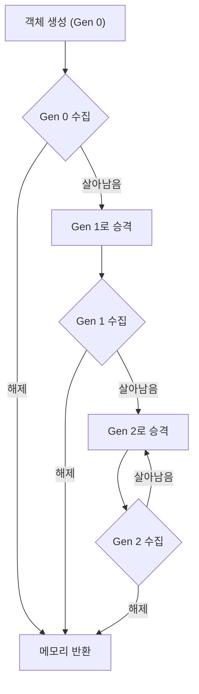

# Garbage Collector(가비지 컬렉터)

# Garbage Collector(가비지 컬렉터)

## 📌 학습 목표
- [Garbage Collector]({{ site.baseurl }}/posts/whatis-gc/)의 동작 원리 이해  
- 세대별(Generational) 수집 구조 설명  
- Stop-the-world 현상과 성능 이슈 학습  
- [RAII]({{ site.baseurl }}/posts/whatis-raii/)와의 차이 비교 (C++ vs C#)  

---

## 📌 개념 정리
- 메모리 관리를 **자동화**하는 메커니즘  
- 프로그램에서 더 이상 사용되지 않는 객체(=reachable 하지 않은 객체)를 탐지 후 자동 해제  
- 대표적으로 **C#, Java, Python** 같은 언어에서 GC가 있음  
- 반대로, **C/C++**은 GC가 없고 프로그래머가 직접 `delete` 또는 [스마트 포인터]({{ site.baseurl }}/posts/whatis-smartpointer/)를 통해 관리  

---


### 2. 동작 방식 (C# 기준)

1. **Mark (표시)**  
   - 살아 있는 객체(참조가 있는 객체)를 식별  

2. **Sweep (청소)**  
   - 참조되지 않는 객체를 해제  

3. **Compact (압축)**  
   - 메모리 단편화를 줄이기 위해 살아남은 객체들을 연속적으로 재배치  

---

### 3. 세대별(Generational) GC
- 객체의 "수명"을 기반으로 효율성을 높임  
- .NET CLR과 JVM 모두 세대별 GC 사용  

| 세대 | 설명 | 특징 |
|------|------|------|
| Gen 0 | 새로 생성된 객체 | 수명이 짧아 수집이 자주 일어남 |
| Gen 1 | Gen 0에서 살아남은 객체 | 임시 저장소 역할 |
| Gen 2 | 장기간 살아남은 객체 | 수집 빈도가 낮음, 오래 쓰는 객체 |

```csharp
var list = new List<int>(); // Gen 0에 할당
list.Add(42);

// Gen 0 수집에서 살아남으면 Gen 1으로 승격
// 장기간 참조되면 Gen 2로 승격
```

---

### 4. Stop-the-world 문제
- GC가 실행되는 동안 **모든 스레드가 일시 중단**됨  
- 대규모 힙/실시간 시스템에서는 성능 저하의 원인  
- 최신 .NET은 **Concurrent / Background GC**로 이 문제를 완화  

---

### 5. C++ [RAII]({{ site.baseurl }}/posts/whatis-raii/) vs C# GC
- **C++ RAII (Resource Acquisition Is Initialization)**  
  - 객체의 생명 주기(`scope`)와 자원 관리가 동일  
  - 블록 종료 시 자동으로 소멸자 호출 → 메모리 즉시 해제  
  - [스마트 포인터]({{ site.baseurl }}/posts/whatis-smartpointer/) (`unique_ptr`, `shared_ptr`)로 안전성 보강  

- **C# GC**  
  - 언제 수거될지 **개발자가 예측 불가**  
  - 결정적 해제가 필요할 땐 [IDisposable]({{ site.baseurl }}/posts/whatis-idisposable/) 패턴과 `using` 사용  

---

## 🎮 Unity의 GC 동작 방식
- Unity는 **Mono/.NET GC** (구버전) 또는 **IL2CPP + Boehm GC / Unity 자체 GC**를 사용  
- 기본적으로 **Mark & Sweep 방식**으로 동작 → Stop-the-world 발생  
- `Update()` 루프 중간에 실행될 수 있어 **프레임 드랍** 원인이 됨  
- GC 최적화 방법:
  - 박싱/언박싱 최소화  
  - `new` 호출 최소화 (Object Pooling 사용)  
  - `string` 연결 대신 `StringBuilder` 활용  

---

## 🎮 Unreal Engine의 GC 동작 방식
- Unreal은 **자체 GC 시스템**을 사용 (C++ 기반)  
- UObject 시스템 위에서 동작: `UObject` 파생 클래스만 GC 관리  
- 참조는 **리플렉션 시스템**(UProperty, UFUNCTION)을 통해 추적  
- `NewObject<T>()` / `DuplicateObject()`로 생성된 객체는 GC가 관리  
- Non-UObject(C++ 기본 타입)는 직접 `delete` 필요  
- GC 주기:
  - 특정 시점마다 `CollectGarbage()` 호출  
  - 엔진이 틱(Tick) 또는 레벨 전환 시 자동 수행  

---

## 📊 C#, Unity, Unreal GC 비교

| 항목 | C# GC (.NET CLR) | Unity GC | Unreal GC |
|------|-----------------|-----------|-----------|
| 방식 | 세대별 GC (Gen 0,1,2) | Mark & Sweep (Mono/IL2CPP) | Mark & Sweep (UObject 기반) |
| 관리 대상 | 모든 관리 객체 | C# 관리 객체 | `UObject` 파생 클래스 |
| 실행 시점 | 런타임 자동 | 런타임 자동, 프레임 중 발생 가능 | 틱/레벨 전환 시, 수동 호출 가능 |
| Stop-the-world | 있음 (최신엔 완화) | 있음 (프레임 드랍 원인) | 있음 (주기적으로) |
| 최적화 포인트 | IDisposable, WeakReference, LOH 관리 | Object Pooling, 구조체 활용, 박싱 최소화 | 스마트 포인터, 수동 메모리 관리 병행 |
| 결정적 해제 | 불가 (IDisposable 필요) | 불가 (C#과 동일) | 수동 `delete` (Non-UObject), RAII 가능 |

---

## 💻 예제 코드

### C#에서 GC 기본 동작
```csharp
class Program
{
    static void Main()
    {
        for (int i = 0; i < 1000; i++)
        {
            var obj = new object();
        }

        // GC 강제 호출 (실무에서는 거의 사용 X)
        GC.Collect();
        GC.WaitForPendingFinalizers();
    }
}
```

### C++ RAII 예시
```cpp
#include <iostream>
#include <memory>
using namespace std;

struct FileHandler {
    FileHandler() { cout << "파일 열기\n"; }
    ~FileHandler() { cout << "파일 닫기\n"; }
};

int main() {
    {
        unique_ptr<FileHandler> fh = make_unique<FileHandler>();
    } // 블록 종료 시 자동으로 소멸자 호출 → 파일 닫기
}
```

---

## 🎯 연습 문제
1. GC의 세대별 수집(Gen 0, 1, 2)의 차이를 설명하세요.  
2. [IDisposable]({{ site.baseurl }}/posts/whatis-idisposable/) 패턴이 필요한 이유와 GC와의 차이를 비교하세요.  
3. C++ [스마트 포인터]({{ site.baseurl }}/posts/whatis-smartpointer/)가 GC와 유사한 점과 다른 점을 설명하세요.  

---

## 🔎 심화 학습
- **Large Object Heap (LOH)**: 85KB 이상의 객체는 별도로 관리  
- **Server GC vs Workstation GC**: 성능 및 환경 최적화 옵션  
- **WeakReference**: GC가 객체를 수집할 수 있게 허용하면서 참조 유지  

---

## 🪞 면접 질문 & 답변

**Q1. GC가 어떻게 동작하나요?**  
A. 루트에서 참조 가능한 객체를 찾고, 참조되지 않는 객체를 해제합니다. 세대별 GC로 효율성을 높이며, 필요할 때 Stop-the-world로 작동합니다.  

**Q2. GC가 항상 좋은가요?**  
A. 편리하지만, 성능 예측이 어렵고 Stop-the-world 문제로 실시간성이 중요한 환경에는 적합하지 않습니다.  

**Q3. C++은 GC가 없는데 어떻게 메모리를 관리하나요?**  
A. RAII와 스마트 포인터를 사용합니다. 객체 생명 주기에 따라 자동 해제가 보장됩니다.  

**Q4. IDisposable과 GC의 차이는 무엇인가요?**  
A. GC는 메모리만 해제하고, `IDisposable`은 파일 핸들, 소켓 같은 **관리되지 않는 자원**을 명시적으로 해제할 때 필요합니다.  

**Q5. C#, Unity, Unreal의 GC 차이를 간단히 설명하세요.**  
A. C#은 CLR 기반 세대별 GC, Unity는 Mono/IL2CPP GC로 프레임 드랍 이슈, Unreal은 UObject 시스템 기반의 자체 GC를 사용합니다.  


---

## 🔗 관련 페이지
- [IDisposable]({{ site.baseurl }}/posts/whatis-idisposable/)  
- [RAII]({{ site.baseurl }}/posts/whatis-raii/)  
- [스마트 포인터]({{ site.baseurl }}/posts/whatis-smartpointer/)  

---

## 🗺️ 다이어그램 (세대별 GC 흐름)


