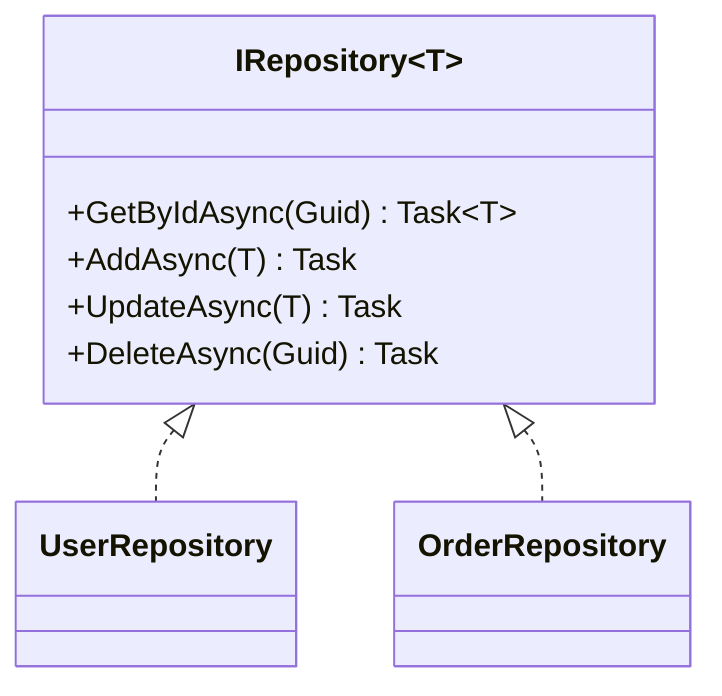
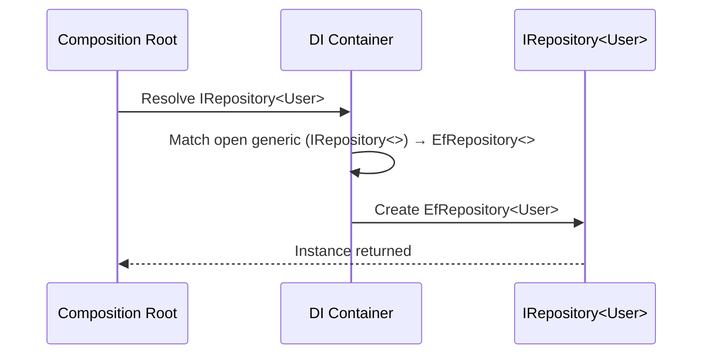

# 제네릭 인터페이스(Generic Interface)

## 📌 학습 목표
- 제네릭 인터페이스의 **개념/필요성** 이해  
- **타입 안정성**, **재사용성**, **성능(박싱 회피)** 관점에서의 장점 파악  
- **공변/반공변(variance)**, **제네릭 제약조건(constraints)** 올바르게 사용하기  
- DI/아키텍처에서 제네릭 인터페이스를 **패턴으로 적용**하는 방법 익히기  

---

## 🧭 무엇이고 왜 쓰나?
**제네릭 인터페이스**는 *타입 매개변수*를 갖는 인터페이스입니다.  
- **타입 안정성**: 컴파일 타임에 타입이 결정되어 캐스팅/런타임 오류 감소  
- **중복 제거 & 재사용성**: 타입만 바꿔 여러 곳에서 동일한 계약 사용  
- **성능 이점**: 값 형식(`struct`)을 다룰 때 비-제네릭보다 **박싱/언박싱을 줄임**  
- **유연한 설계**: DI/전략/리포지토리/핸들러 패턴 등에서 핵심 계약으로 사용

연관 글:  
- [인터페이스]({{ site.baseurl }}/posts/whatis-interface/) · [의존성 주입(DI)]({{ site.baseurl }}/posts/whatis-dependency-injection/) · [SOLID]({{ site.baseurl }}/posts/whatis-solid/) · [박싱/언박싱]({{ site.baseurl }}/posts/whatis-boxingunboxing/)  

---

### 성능 이점의 대한 예시

제네릭 인터페이스는 “값 형식(struct)”을 다룰 때 object로 바꾸는 박싱/언박싱을 피할 수 있게 설계되어서 성능 이점이 생긴다.

- 박싱: struct 값을 힙에 새 객체로 복사해서 object(또는 비제네릭 인터페이스)의 형태로 다루는 것

- 언박싱: 그 object에서 원래 값으로 다시 꺼내는 것
→ 추가 할당/복사 + GC 부담 + 분기비용 → 성능 저하

비제네릭 API는 보통 인자/반환형이 object나 비제네릭 인터페이스여서 값 형식을 쓰면 항상 박싱이 섞이기 쉽다.

- 비제네릭 사용 예(박싱이 발생)
```csharp
IComparable c = new Money { Won = 100 }; // ← 여기서 struct가 인터페이스로 저장되며 **박싱**
c.CompareTo(new Money { Won = 50 });     // 인자도 object로 다뤄져 **박싱**
```

- 제네릭 제약을 통한 사용(박싱 미발생)
```csharp
static T Max<T>(T a, T b) where T : IComparable<T>
    => a.CompareTo(b) >= 0 ? a : b;  // 여기서 JIT가 'constrained call'을 써서 **박싱 없이** 호출
```


그래서, 다음과 같은 결과가 나온다.


```csharp
var arr  = new System.Collections.ArrayList();
arr.Add(123);        // int(값 형식) → object로 **박싱**
int v1 = (int)arr[0]; // 다시 꺼낼 때 **언박싱**

var list = new List<int>();
list.Add(123);       // **박싱 없음** (값이 그대로 저장)
int v2 = list[0];    // **언박싱 없음**
```

## 🧩 기본 형태와 사용 예

### 1) 리포지토리 패턴
```csharp
public interface IRepository<T> where T : class
{
    Task<T?> GetByIdAsync(Guid id);
    Task AddAsync(T entity);
    Task UpdateAsync(T entity);
    Task DeleteAsync(Guid id);
    IAsyncEnumerable<T> GetAllAsync();
}

public class UserRepository : IRepository<User> { /* 구현 */ }
public class OrderRepository : IRepository<Order> { /* 구현 */ }
```
- **장점**: 엔티티별 리포지토리를 하나의 계약으로 통일, 테스트/DI 쉬움

### 2) 핸들러/파이프라인(메시지 기반)
```csharp
public interface ICommandHandler<TCommand>
{
    Task HandleAsync(TCommand command, CancellationToken ct = default);
}

public interface IQueryHandler<TQuery, TResult>
{
    Task<TResult> HandleAsync(TQuery query, CancellationToken ct = default);
}
```
- **장점**: 요청/응답 타입으로 **행위까지 타입 안전**하게 모델링

### 3) 컬렉션 계약과 성능 (박싱 회피)
```csharp
public interface IBuffer<T>
{
    void Write(T value);
    bool TryRead(out T value);
}
```
- `IBuffer<int>`처럼 **값 타입**을 직접 다루면 `ArrayList/object` 대비 박싱 감소 → GC 부담 완화  
  (자세한 배경: [Garbage Collector]({{ site.baseurl }}/posts/whatis-gc/))

---

## 🔐 제네릭 제약조건(Constraints)

**언제/왜 쓰나?**  
- 인터페이스에 **요구사항**을 명시해 구현/호출 측의 **유효한 타입만** 허용

```csharp
public interface IFactory<T> where T : new()
{
    T Create() => new T(); // 매개변수 없는 생성자 보장
}

public interface ICloneable<T> where T : ICloneable<T>
{
    T Clone();
}

public interface IRefOnly<T> where T : class { }    // 참조형만
public interface IValueOnly<T> where T : struct { } // 값형만
```

---

## 🔄 공변/반공변 (Variance)

- **공변(Covariance)** `out T`: `IProducer<Derived>`는 `IProducer<Base>`로 **대입 가능**  
- **반공변(Contravariance)** `in T`: `IConsumer<Base>`는 `IConsumer<Derived>`로 **대입 가능**  
- **불변(Invariance)**: 아무 쪽도 아님 (기본)

```csharp
// 공변의 예시
IEnumerable<Cat> cats = new List<Cat>();
IEnumerable<Animal> animals = cats; // ✅ 공변: Cat → Animal

Func<Cat> makeCat = () => new Cat();
Func<Animal> makeAnimal = makeCat;  // ✅ 반환형 공변

// 반공변의 예시
Action<Animal> handleAnimal = a => { /* ... */ };
Action<Cat> handleCat = handleAnimal; // ✅ 반공변: Animal 소비자는 Cat에도 사용 가능

IComparer<Animal> cmpA = /* ... */;
IComparer<Cat>    cmpC = cmpA;        // ✅ 반공변
```

> **주의**: `out`은 반환 전용, `in`은 입력 전용에 적합. 컬렉션처럼 **입출력 혼합**이면 불변이어야 안전.

---

## 🧪 DI와 함께 쓰는 패턴

### 컬렉션/오픈 제네릭 등록
```csharp
// .NET DI: 오픈 제네릭 등록
services.AddScoped(typeof(IRepository<>), typeof(EfRepository<>));

// 여러 핸들러를 한 번에 주입
services.AddTransient<ICommandHandler<CreateUser>, CreateUserHandler>();
services.AddTransient<ICommandHandler<DeactivateUser>, DeactivateUserHandler>();
```

### 런타임 선택 (팩토리 주입)
```csharp
services.AddTransient(typeof(IQueryHandler<,>), typeof(DefaultQueryHandler<,>));
services.AddTransient<Func<Type, object>>(sp => t => sp.GetRequiredService(t));
```

---

## ⚙️ 고급: 기본 구현(Default Interface Methods, C# 8+)

> 인터페이스에 **기본 메서드**를 제공해 호환성 유지 (단, 남용하면 **SRP/ISP** 흐트러짐)

```csharp
public interface IRetryPolicy<T>
{
    Task<T> ExecuteAsync(Func<Task<T>> action, int retry = 3);
    async Task<T> ExecuteWithBackoffAsync(Func<Task<T>> action)
        => await ExecuteAsync(action, retry: 5);
}
```

---

## 🧠 C++/Java와 비교

| 항목 | **C# 제네릭** | **C++ 템플릿** | **Java 제네릭** |
|---|---|---|---|
| 컴파일 모델 | **재화(런타임 보존)**, CLR이 타입별 코드 생성 | 컴파일 타임 **메타프로그래밍**, 인스턴스별 코드 생성 | **타입 소거(Type Erasure)**, 런타임엔 원시 타입 |
| 성능 | 값 타입에서 박싱 회피, 최적화 우수 | 최적화 매우 우수, 하지만 컴파일 시간↑ | 경계 와일드카드로 유연성, 박싱 발생 여지 |
| 문법/제약 | `where T : ...`, variance `in/out` | SFINAE/컨셉트, 부분 특수화 | `extends/super` 와일드카드, 제약 한정적 |
| 에코시스템 | LINQ/IAsyncEnumerable와 자연스러운 결합 | STL/범위/컨셉트로 강력 | 풍부한 컬렉션/스트림 API |

> 인터뷰 포인트: **C#은 재화(reified) 제네릭**이라 런타임에 타입 정보가 남아 리플렉션/DI에 유리.

---

## 🚨 흔한 실수 & 주의점
- **과도한 추상화**: 간단한 로직까지 제네릭으로 만들면 **인지부하↑**  
- **변성 오용**: `out/in`을 잘못 지정하면 **타입 안전성** 붕괴  
- **박싱 발생 지점**: `IComparable` 등 **비제네릭 인터페이스**로 취급하면 값 형식이 박싱될 수 있음  
- **제약조건 누락**: `new()`/`class`/`struct`/인터페이스 제약으로 **의도한 사용만 허용**할 것

---

## 🗺️ 다이어그램

### 1) 제네릭 리포지토리 구조


### 2) DI 해석 시퀀스 (오픈 제네릭)


---

## 💻 실전 스니펫

### 1) 공변/반공변 실제 적용
```csharp
public interface IEventPublisher<out TEvent> { void Publish(TEvent e); } // out? 반환만? → 여기선 out 부적절
// 바른 예: out은 반환형에만 쓰기 좋다. 입력이 있으면 불변으로 두자.

public interface IFormatter<in T>
{
    string Format(T value); // 입력만 → in 적합 (반공변)
}
```

### 2) 제약조건으로 API 정확도 높이기
```csharp
public interface IEntity { Guid Id { get; } }

public interface IEntityRepository<T> where T : class, IEntity
{
    Task<T?> FindAsync(Guid id);
    Task SaveAsync(T entity);
}
```

### 3) 값 타입에서도 박싱 없이 동작하는 계약
```csharp
public interface IAccumulator<T>
{
    void Add(T value);
    T Sum { get; }
}

public struct IntAccumulator : IAccumulator<int> { /* 박싱 없이 정수 누적 */ }
```

---

## 🎯 연습 문제
1. `IRepository<T>`에 **사양 필터링**을 추가해 `IEnumerable<ISpecification<T>>`로 쿼리 확장해보세요.  
2. `IFormatter<in T>`와 `IParser<out T>`를 정의하고 **반공변/공변** 사용 예를 만들어 보세요.  
3. DI 컨테이너에 `IQueryHandler<TQuery, TResult>`를 **오픈 제네릭 등록**하고, 런타임에 적절한 구현이 해석되는지 테스트하세요.  
4. 값 타입 `struct`를 다루는 제네릭 인터페이스에서 **박싱이 발생하지 않도록** 설계를 점검하세요.  

---

## 🪞 면접 질문 & 답변

**Q1. 제네릭 인터페이스의 장점은?**  
A. 타입 안전성, 중복 제거, 재사용성, 값 타입에서의 **박싱 최소화**, DI/테스트 용이성.

**Q2. 공변/반공변을 설명하고 실제 예를 드세요.**  
A. `out`(공변): 반환 전용(`IEnumerable<out T>`), `in`(반공변): 입력 전용(`IComparer<in T>`).  
`IFormatter<in T>`는 다양한 상위 타입 입력을 허용해 유연함.

**Q3. C# 제네릭과 Java 제네릭의 차이?**  
A. C#은 **재화**로 런타임 타입 정보 유지·박싱 최소화·DI 친화적. Java는 **타입 소거**.

**Q4. 언제 제약조건을 써야 하나요?**  
A. `new()`, `class/struct`, 특정 인터페이스 등을 요구해 **의도한 타입만 허용**하고 API 가독성을 높일 때.

---

## 🔗 관련 글
- [인터페이스]({{ site.baseurl }}/posts/whatis-interface/)  
- [의존성 주입(DI)]({{ site.baseurl }}/posts/whatis-dependency-injection/)  
- [SOLID 원칙]({{ site.baseurl }}/posts/whatis-solid/)  
- [박싱/언박싱]({{ site.baseurl }}/posts/whatis-boxingunboxing/)  
- [C# 기본 문법과 OOP]({{ site.baseurl }}/posts/csharp-basic-oop/)  

---