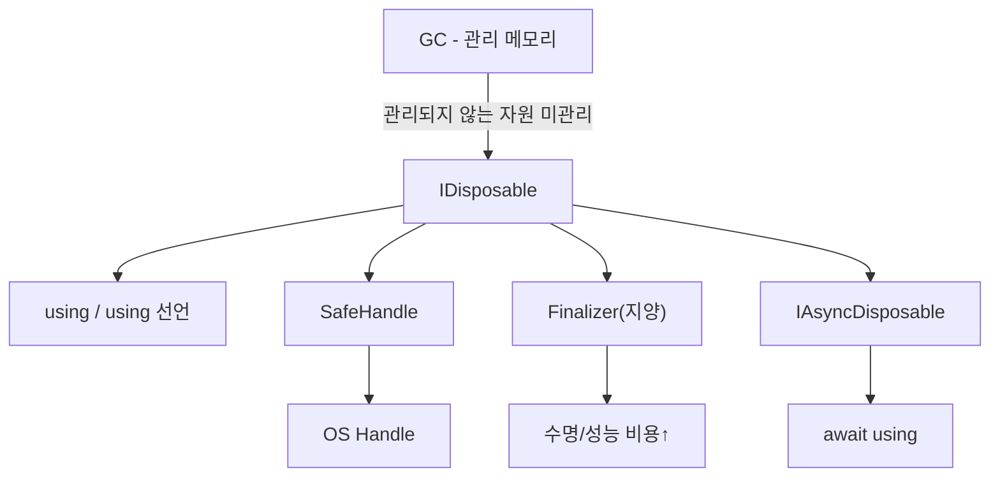

# IDisposable 패턴

## 📌 학습 목표
- 명시적 자원 해제  
- `Dispose` 메서드와 `using` 구문 이해  
- `using` 문/선언의 동작(try/finally 전개) 이해  
- Finalizer(종종 "소멸자")와의 관계, `SafeHandle` 권장 패턴 이해  


## 📌 개념 정리
- C#에서 자원을 명시적으로 해제하기 위한 인터페이스
- Dispose() 메서드를 통해 관리되지 않는 자원 해제
- using 문과 함께 사용하여 자동 자원 해제 보장
- 관리되지 않는 자원(파일, DB 연결, 소켓 등) 해제  
- `Dispose()` 메서드 구현 후 `using` 블록에서 자동 호출  

---

## 🧭 왜 IDisposable이 필요한가?
.NET의 [[Garbage Collector]]({{ site.baseurl }}/posts/whatis-gc/)는 **관리되는 메모리**(managed heap)만 회수한다.  
하지만 실제 애플리케이션은 다음과 같은 **관리되지 않는 자원**(unmanaged resources)을 자주 다룬다.

- 파일 핸들, 소켓, 데이터베이스 커넥션, OS 핸들, GPU/네이티브 라이브러리 포인터…
- 대규모 버퍼/핸들 누수는 **프로세스 핸들 고갈·메모리 압박·성능 저하**를 유발

따라서 “**GC가 아닌** 개발자가 **명시적으로** 해제해야 하는 경로”가 필요하고, 그 계약이 **IDisposable**이다.

---


## 🧩 핵심 개념 정리

### 1) IDisposable
- 인터페이스 한 줄: `void Dispose()`  
- **계약**: “이 객체가 보유한 자원을 더 이상 쓰지 않으니 정리해라”
- **요구사항**: **idempotent**(여러 번 호출해도 안전), **빠르고 예외 최소화**

### 2) using 문과 using 선언
- **using 문**  
  ```csharp
  using (var fs = new FileStream("a.txt", FileMode.Open))
  {
      // 사용
  } // try/finally로 전개 → finally에서 Dispose 호출
  ```
- **using 선언(C# 8+)**  
  ```csharp
  using var fs = new FileStream("a.txt", FileMode.Open);
  // 스코프 종료 시 Dispose 자동 호출
  ```

### 3) Finalizer(~ClassName)와 GC.SuppressFinalize
- Finalizer는 **GC가 객체를 수거할 때** 호출되는 비결정적(clean-up) 경로  
- **가능하면 사용을 지양**: Finalizer는 성능/수명에 악영향 (Gen 0 → finalization queue)  
- 꼭 필요하면 `Dispose(bool disposing)` 패턴과 함께 쓰고, 명시 Dispose 시 `GC.SuppressFinalize(this)` 호출

### 4) SafeHandle 권장
- 네이티브 핸들을 **직접 IntPtr로 관리**하는 대신, `SafeHandle` 파생 클래스를 사용해 수명·예외 안전 강화  
- 파일·레지스트리·파이프 등 BCL 클래스도 내부적으로 SafeHandle 패턴을 활용

### 5) IAsyncDisposable (C# 8+)
- 비동기 해제가 필요한 자원(예: 네트워크 스트림, DB 커넥션 풀)의 **비동기 정리**를 지원  
- `await using` 구문으로 `DisposeAsync()` 호출

---

## ✅ 표준 Dispose 패턴(권장 구현)

### A. **관리 자원만** 해제(간단한 경우, Finalizer 불필요)
```csharp
public sealed class BufferPool : IDisposable
{
    private bool _disposed;
    private readonly List<byte[]> _buffers = new();

    public void Rent(int size) {
        ThrowIfDisposed();
        _buffers.Add(new byte[size]);
    }

    public void Dispose()
    {
        if (_disposed) return;
        _buffers.Clear(); // 관리 자원 정리
        _disposed = true;
    }

    private void ThrowIfDisposed()
    {
        if (_disposed) throw new ObjectDisposedException(GetType().FullName);
    }
}
```

### B. **관리 + 비관리 자원** (SafeHandle 사용, Finalizer 선택적)
```csharp
using Microsoft.Win32.SafeHandles;
using System.Runtime.InteropServices;

public class NativeFile : IDisposable
{
    private bool _disposed;
    private SafeFileHandle _handle; // 안전한 핸들 래퍼

    public NativeFile(string path)
    {
        _handle = CreateFile(path);
        if (_handle.IsInvalid) throw new IOException("파일 열기 실패");
    }

    public void Dispose()
    {
        Dispose(disposing: true);
        GC.SuppressFinalize(this); // Finalizer 필요 시에만 정의
    }

    protected virtual void Dispose(bool disposing)
    {
        if (_disposed) return;

        // 1) 관리 자원 해제 (disposing == true일 때만)
        if (disposing)
        {
            // 다른 IDisposable 필드들 Dispose
        }

        // 2) 비관리 자원 해제 (항상)
        _handle?.Dispose();

        _disposed = true;
    }

    // ~NativeFile() { Dispose(false); } // 정말 필요한 경우에만 Finalizer 추가

    // 예시: P/Invoke 래퍼 (실무에서는 SafeFileHandle 파생을 직접 구현하기도 함)
    private static SafeFileHandle CreateFile(string path)
    {
        // 데모용 가짜 핸들 생성이라 가정
        return new SafeFileHandle(IntPtr.Zero, true);
    }
}
```

### C. 파생 가능 클래스의 Dispose 패턴
```csharp
public class BaseResource : IDisposable
{
    private bool _disposed;

    public void Dispose()
    {
        Dispose(true);
        GC.SuppressFinalize(this);
    }

    protected virtual void Dispose(bool disposing)
    {
        if (_disposed) return;

        if (disposing)
        {
            // 관리 자원 정리
        }
        // 비관리 자원 정리

        _disposed = true;
    }
}

public class DerivedResource : BaseResource
{
    private bool _disposed;

    protected override void Dispose(bool disposing)
    {
        if (_disposed) return;

        if (disposing)
        {
            // 파생 타입 관리 자원 정리
        }
        // 파생 타입 비관리 자원 정리

        _disposed = true;
        base.Dispose(disposing);
    }
}
```

---

## 🧵 IAsyncDisposable & `await using`
```csharp
public sealed class AsyncConnection : IAsyncDisposable
{
    private bool _disposed;

    public async ValueTask DisposeAsync()
    {
        if (_disposed) return;
        // 비동기 해제 로직 (예: 남은 패킷 flush, 원격 종료 시그널)
        await Task.CompletedTask;
        _disposed = true;
    }
}

// 사용
await using var conn = new AsyncConnection();
// 작업…
```

---

## 🧨 자주 하는 실수 & 베스트 프랙티스

- **❌ Finalizer 남발**: 정말 비관리 자원을 직접 소유할 때만. 가능하면 `SafeHandle` 사용  
- **❌ Dispose에서 예외 던지기**: 해제는 최대한 **best effort** (로그 후 무시 or 최소화)  
- **✅ 다중 호출 허용**: `Dispose()`는 **idempotent** 해야 함  
- **✅ 상태 체크**: `ThrowIfDisposed()`로 사용 중 Dispose 여부 명확히  
- **✅ DI/스코프**: ASP.NET Core DI에서 스코프가 끝나면 `IDisposable` 서비스 자동 Dispose  
- **✅ `Close()` vs `Dispose()`**: 대부분 동일 동작. 가능하면 `using`으로 통일  
- **✅ 소유권 명확히**: “리턴한 `Stream`을 누가 Dispose?” → **문서/네이밍/팩토리로 규약**  
- **✅ using 선언(C# 8+)**: 스코프가 긴 경우에도 깔끔한 정리 보장  
- **❌ `GC.Collect()` 강제 호출**: 실무에선 피함 (성능 악영향)

---

## 💡 면접 대비 포인트

### 1) Dispose vs Finalize 차이?
- **Dispose**: **개발자가 직접** 호출(또는 `using`으로 간접). **결정적 정리(Deterministic)**  
- **Finalize**: GC가 나중에 호출. **비결정적**, 성능/수명에 악영향. 가능한 회피

### 2) 언제 Finalizer를 구현해야 하나?
- `SafeHandle` 없이 **직접** 비관리 자원을 소유하고, 누수가 **치명적**일 때.  
- 그래도 가능하면 **SafeHandle**로 이동하고 Finalizer 제거

### 3) 왜 `GC.SuppressFinalize(this)`가 필요한가?
- 이미 `Dispose()`로 정리했으니 Finalizer 큐에 올려 **중복 정리**와 **비용**을 피하려고

### 4) `Dispose(bool disposing)` 패턴에서 `disposing` 의미?
- `true`: 개발자 코드에서 호출 → **관리 자원 + 비관리 자원** 정리  
- `false`: Finalizer 경로 → **비관리 자원만** 안전하게 정리

### 5) `IAsyncDisposable`이 필요한 경우?
- 해제가 **비동기 I/O**를 수반(네트워크 flush, 비동기 닫기)할 때  
- `await using`으로 안전하게 비동기 정리

### 6) `using` 문이 실제로 어떻게 동작하나?
- 컴파일러가 **try/finally**로 전개, finally에서 `Dispose()` 호출을 보장

### 7) `SafeHandle` vs `IntPtr` 직접 관리?
- `SafeHandle`은 **수명·예외 안전**을 캡슐화(핸들 중복 해제·누수 방지)  
- 가능하면 `SafeHandle` 우선

### 8) Dispose에서 예외가 나면?
- 가능하면 **삼켜서** 로깅(특히 `finally` 경로).  
- 복수 자원 정리 시 한 곳에서 예외가 나도 **나머지 정리 시도**

### 9) 다중 Dispose 호출은 안전한가?
- **반드시** 안전해야 한다(idempotent). 내부 플래그로 재진입 방지

### 10) 상속 관계에서 Dispose는 어떻게 작성?
- `protected virtual Dispose(bool)`을 기반으로 **파생 → base** 순서로 호출  
- `sealed` 타입이면 단순 `Dispose()`만으로 충분

### 11) DI 컨테이너와 IDisposable
- ASP.NET Core: 스코프 종료 시 **자동 Dispose**. 스코프 외로 **누수**시키지 말 것

### 12) C++ [[RAII]]({{ site.baseurl }}/posts/whatis-raii/)와의 관계?
- C++: **스코프 종료 시 소멸자 자동 호출**(결정적)  
- C#: GC 기반 → **IDisposable로 결정적 정리를 보강**

---

## 🧪 연습 문제

1) **간단 Disposable**  
- 메모리 버퍼를 잡아두는 `BufferOwner`를 만들고, `Dispose()`에서 버퍼를 해제하라.  
- 두 번 `Dispose()` 호출해도 안전해야 한다.

2) **비관리 자원 케이스**  
- (가정) 네이티브 핸들을 감싸는 `SafeHandle` 파생 클래스를 만들고, 이를 필드로 갖는 `NativeThing`을 구현하라.  
- `Dispose(bool)` 패턴과 `GC.SuppressFinalize`를 정확히 적용하라.

3) **IAsyncDisposable**  
- 네트워크 스트림을 흉내 내는 `AsyncStream`을 만들고, `DisposeAsync()`에서 `await Task.Delay(10)` 후 정리하도록 하라.  
- `await using`으로 사용 예제 작성.

---

## 🔗 관련 페이지
- [[Garbage Collector]]({{ site.baseurl }}/posts/whatis-gc/)  
- [[async-await]]({{ site.baseurl }}/posts/whatis-asyncawait/)  
- [[박싱과 언박싱]]({{ site.baseurl }}/posts/whatis-boxingunboxing/)  
- [[RAII]]({{ site.baseurl }}/posts/whatis-raii/)  

---

## 🗺️ 개념 맵 (Mermaid)


