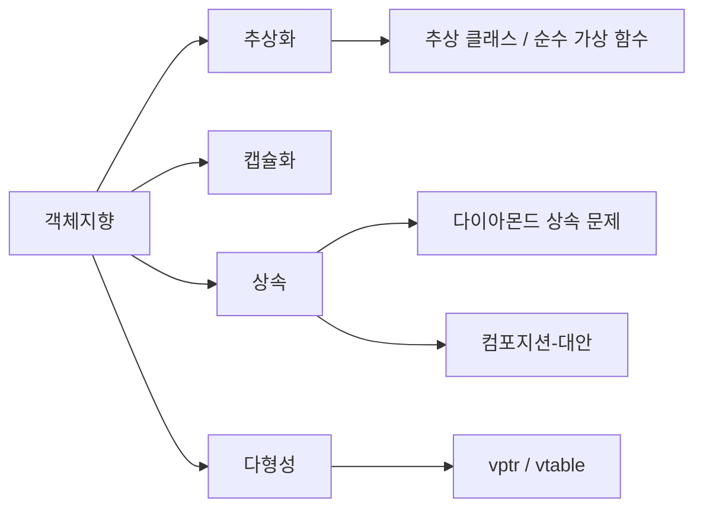

# 객체지향(OOP - Object Oriented Programming)

## 📌 개념 정리
- [객체지향]({{ site.baseurl }}/posts/whatis-oop/)(OOP, Object-Oriented Programming)은 **데이터와 행위를 객체 단위로 묶어서** 설계하는 방법론.  
- 주요 특징 (4대 특성)
  1. **추상화 (Abstraction)**
  2. **캡슐화 (Encapsulation)**
  3. **[상속]({{ site.baseurl }}/posts/whatis-inheritance/) (Inheritance)**
  4. **[다형성]({{ site.baseurl }}/posts/whatis-polymorphism/) (Polymorphism)**

---

## 1) 추상화 (Abstraction)
**핵심 아이디어**  
- 복잡한 현실/구현 세부를 감추고 **본질적인 공통 행위와 속성만** 드러내는 것.  
- C++에서는 주로 [추상클래스]({{ site.baseurl }}/posts/whatis-abstractclass/)와 [순수가상함수]({{ site.baseurl }}/posts/whatis-purevirtualfunction/)로, C#에서는 `abstract class`(또는 interface)로 표현.


#### 예시

게임을 만드려고 한다. 여기서, 적과 주인공이 등장을 하고 서로 싸운다.

- 절차지향적 프로그래밍
	- 각 적을 각각의 객체로 생성을 하고, 각각의 역할과 데이터, 작업을 작성한다.
	- ex) enemy1 - 체력, 공력력, 방어력, 스킬, 등등...
	- ex) enemy2 - 체력, 공력력, 방어력, 스킬, 등등...
	- ex) hero - 체력, 공력력, 방어력, 스킬, 입력, UI연동 등등...

- OOP적 프로그래밍
	- 공통된 요소를 하나로 묶은 추상 클래스를 생성하고, 이를 상속받은 각각의 자식 클래스를 만든다.
	- ex) character class -> 체력, 공격력, 방어력, ID, 죽는 모션
	- ex) enemy1: character class -> 스킬, 모션, sprite, (추가적으로 character class에 있는 것)
	- ex) hero : character class -> 입력, UI연동, 스킬, 모션, sprite, (추가적으로 character class에 있는 것)
	- 외부에서 호출할 때 단순하게 character class 를 호출하여 사용할 수 있다.


**C++ 포인트**
- [순수가상함수]({{ site.baseurl }}/posts/whatis-purevirtualfunction/)로 인터페이스 역할을 정의 → 클래스를 [추상클래스]({{ site.baseurl }}/posts/whatis-abstractclass/)로 만든다.
- 파생 [클래스]({{ site.baseurl }}/posts/whatis-class/)가 구체 구현을 제공해 **확장에 열려(Open)** 있게 함.

```cpp
struct Shape { // [추상클래스]({{ site.baseurl }}/posts/whatis-abstractclass/)
    virtual ~Shape() = default;
    virtual double Area() const = 0; // [순수가상함수]({{ site.baseurl }}/posts/whatis-purevirtualfunction/)
};
struct Circle : Shape {
    double r;
    explicit Circle(double r) : r(r) {}
    double Area() const override { return 3.14159 * r * r; }
};
```

**C# 포인트**
```csharp
public abstract class Sensor {               // [추상클래스]({{ site.baseurl }}/posts/whatis-abstractclass/)
    public abstract float Read();            // 추상 메서드 (= 순수 가상과 유사)
}
public class TempSensor : Sensor {
    public override float Read() => 36.5f;
}
```

**언제 쓰나 / 주의점**
- “무엇을 할 수 있는가(계약)” 만 노출하고 “어떻게 하는가(구현)”는 감춘다.  
- 추상화 계층이 과도하면 오히려 복잡도 ↑. 실사용 지점과 **의미 있는 경계**에서만 도입.

**연결 개념**: [추상클래스]({{ site.baseurl }}/posts/whatis-abstractclass/), [순수가상함수]({{ site.baseurl }}/posts/whatis-purevirtualfunction/), [클래스]({{ site.baseurl }}/posts/whatis-class/), [상속]({{ site.baseurl }}/posts/whatis-inheritance/), [다형성]({{ site.baseurl }}/posts/whatis-polymorphism/)

---

## 2) 캡슐화 (Encapsulation)
**핵심 아이디어**  
- 데이터와 행위를 하나의 [클래스]({{ site.baseurl }}/posts/whatis-class/)로 묶고, **접근 제어**를 통해 내부 상태를 보호한다.  
- 불변식(invariant)을 지키는 메서드만 외부에 공개 → 객체 일관성 유지.

**C++ 포인트**
- `private/protected/public` 접근 지정자, 게터/세터 대신 **의미 있는 동작 메서드** 권장.
```cpp
class BankAccount {
    double balance_; // private -> 외부 직접 접근 불가
public:
    explicit BankAccount(double b) : balance_(b) {}
    void Deposit(double x) { if (x > 0) balance_ += x; }
    bool Withdraw(double x) { if (x <= balance_) { balance_ -= x; return true; } return false; }
    double Balance() const { return balance_; }
};
```

**C# 포인트**
- 자동 속성 + 제한된 setter로 불변식 보존.
```csharp
public class BankAccount {
    public decimal Balance { get; private set; }
    public void Deposit(decimal x) { if (x > 0) Balance += x; }
    public bool Withdraw(decimal x) {
        if (x <= Balance) { Balance -= x; return true; }
        return false;
    }
}
```

**언제 쓰나 / 주의점**
- 외부에 **상태 자체**를 노출하지 말고, **의미 있는 행위**만 제공.  
- 캡슐화 약화 요인: public 필드 남발, 광범위한 `friend`(C++), 무분별한 setter.

**연결 개념**: [클래스]({{ site.baseurl }}/posts/whatis-class/), [컴포지션]({{ site.baseurl }}/posts/whatis-composition/), [상속]({{ site.baseurl }}/posts/whatis-inheritance/)

---

## 3) 상속 (Inheritance)
**핵심 아이디어**  
- 상위 [클래스]({{ site.baseurl }}/posts/whatis-class/)의 속성과 행위를 하위 [클래스]({{ site.baseurl }}/posts/whatis-class/)가 **재사용/확장**.  
- **is-a** 관계에서 적합. [다형성]({{ site.baseurl }}/posts/whatis-composition/)의 기반이 된다.

**C++ 포인트**
- `public/protected/private` 상속, 다중 상속 지원.  
- 다중 상속 시 [다이아몬드상속문제]({{ site.baseurl }}/posts/whatis-diamondinheritanceproblem/) 발생 가능 → `virtual` 상속으로 해결.

```cpp
struct A { virtual ~A() = default; };
struct B : virtual A {};
struct C : virtual A {};
struct D : B, C {}; // 다이아몬드 상속 문제 방지 (virtual 상속)
```

**C# 포인트**
- 단일 상속만 허용(클래스 기준). 다중 행위 확장은 인터페이스로 해결.

**언제 쓰나 / 주의점**
- “진짜 is-a인가?”를 먼저 검증. **is-implemented-in-terms-of** 라면 [컴포지션]({{ site.baseurl }}/posts/whatis-composition/)이 더 적합.  
- 상위 변경이 하위에 연쇄 영향(리스코프 치환 위반) 주의.

**연결 개념**: [다이아몬드상속문제]({{ site.baseurl }}/posts/whatis-diamondinheritanceproblem/), [다형성]({{ site.baseurl }}/posts/whatis-composition/), [컴포지션]({{ site.baseurl }}/posts/whatis-composition/), [클래스]({{ site.baseurl }}/posts/whatis-class/)

---

## 4) 다형성 (Polymorphism)
**핵심 아이디어**  
- 같은 메시지(인터페이스)에 **여러 다른 구현**이 응답.  
- 정적 다형성(오버로딩/템플릿) + 동적 다형성(런타임 바인딩).

**C++ 포인트 (동적)**
- `virtual` 함수 사용 시 객체에 [가상함수vptr]({{ site.baseurl }}/posts/whatis-vptr/)가 생기고, [vtable]({{ site.baseurl }}/posts/whatis-vtable/)을 통해 **런타임 디스패치**.
```cpp
#include <iostream>
struct Base { 
    void f() { std::cout << "Base::f\n"; }       // 정적 바인딩
    virtual void g() { std::cout << "Base::g\n"; } // 동적 바인딩 -> vtable
};
struct Der : Base {
    void f() { std::cout << "Der::f\n"; }        // 숨김(hiding)
    void g() override { std::cout << "Der::g\n"; }
};
int main() {
    Base* p = new Der();
    p->f(); // Base::f (정적 바인딩)
    p->g(); // Der::g  (동적 바인딩, 가상 함수 vptr/vtable)
    delete p;
}
```

**C# 포인트**
- `virtual/override`(동적 바인딩), `sealed`(오버라이드 금지), `new`(숨김) 등으로 제어.

```csharp
class Base { public virtual void G() => Console.WriteLine("Base.G"); }
class Der  : Base { public override void G() => Console.WriteLine("Der.G"); }
```

**언제 쓰나 / 주의점**
- 조건문 분기 대신 **다형적 호출**로 복잡도 감소.  
- C++에선 소멸자도 `virtual` 고려(다형적 삭제 안전성).  
- 성능 민감 구간에선 **정적 다형성(템플릿)** 도 대안.

**연결 개념**: [가상함수vptr]({{ site.baseurl }}/posts/whatis-vptr/), [vtable]({{ site.baseurl }}/posts/whatis-vtable/), [상속]({{ site.baseurl }}/posts/whatis-inheritance/), [추상클래스]({{ site.baseurl }}/posts/whatis-abstractclass/)

---

## 🔗 관련 페이지
- [클래스]({{ site.baseurl }}/posts/whatis-class/)  
- [상속]({{ site.baseurl }}/posts/whatis-inheritance/)  
- [다형성]({{ site.baseurl }}/posts/whatis-composition/)  
- [컴포지션]({{ site.baseurl }}/posts/whatis-composition/)  
- [추상클래스]({{ site.baseurl }}/posts/whatis-abstractclass/)  
- [순수가상함수]({{ site.baseurl }}/posts/whatis-purevirtualfunction/)  
- [가상함수vptr]({{ site.baseurl }}/posts/whatis-vptr/)  
- [vtable]({{ site.baseurl }}/posts/whatis-vtable/)  
- [다이아몬드상속문제]({{ site.baseurl }}/posts/whatis-diamondinheritanceproblem/)

---
## 🗺️ 개념 맵 (간단 다이어그램)


